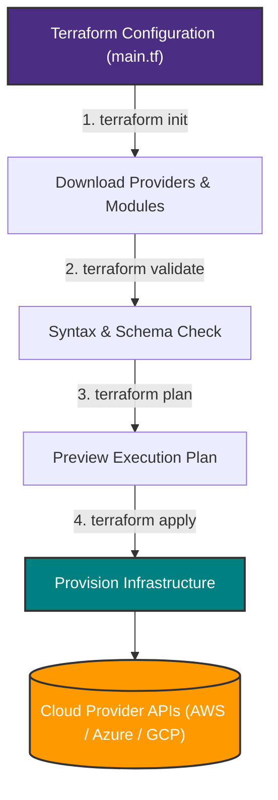
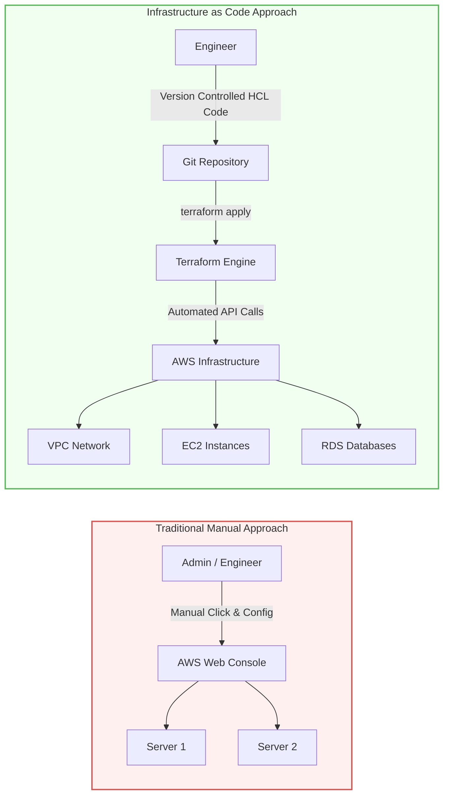

# Day 1 — Introduction to Terraform

> **31 Days of Terraform** — A hands-on journey to learn Terraform and Infrastructure as Code.

---

## Topics Covered

* [ ] Understanding Infrastructure as Code (IaC)
* [ ] Why we need IaC
* [ ] What is Terraform and its benefits
* [ ] Challenges with the traditional approach
* [ ] Terraform workflow
* [ ] Installing Terraform

---

## What is Infrastructure as Code?

**Infrastructure as Code (IaC)** is the practice of provisioning and managing infrastructure through code instead of performing configuration manually.

Instead of manually creating resources such as:

* Virtual machines
* Networks
* Databases
* Load balancers
* Security groups

we define the desired infrastructure in configuration files and use tools like Terraform to provision and manage it.

### Traditional Approach

```text
Engineer
   │
   ├── Create Server Manually
   ├── Configure Network
   ├── Configure Security
   ├── Install Dependencies
   └── Repeat for Every Environment
```

### Infrastructure as Code

```text
Terraform Configuration
          │
          ▼
      Terraform
          │
          ▼
   Cloud Provider API
          │
          ▼
     Infrastructure
```

---

## Why Do We Need IaC?

Managing infrastructure manually becomes increasingly difficult as environments grow.

### Problems With the Traditional Approach

* Manual configuration is time-consuming
* Human errors are common
* Difficult to maintain consistency
* Hard to reproduce environments
* Difficult to track infrastructure changes
* Scaling requires more manual effort
* Collaboration becomes difficult
* Infrastructure configuration can become undocumented

IaC addresses these problems by treating infrastructure configuration as code.

---

## Benefits of Infrastructure as Code

### Consistency

The same code can be used to create consistent environments across:

```text
Development
     │
     ├── Staging
     │
     └── Production
```

### Time Efficiency

Infrastructure provisioning can be automated instead of repeating manual configuration steps.

### Cost Management

Infrastructure can be created and destroyed through automation, making it easier to manage resources and avoid unnecessary usage.

### Scalability

The same infrastructure definition can be used to provision one resource or hundreds of resources.

### Version Control

Infrastructure code can be stored in Git, allowing us to:

* Track changes
* Review modifications
* Roll back changes
* Collaborate with a team

### Reduced Human Error

Automating repetitive infrastructure configuration reduces the possibility of manual configuration mistakes.

### Collaboration

Teams can collaborate on infrastructure using the same workflows used for application code.

### Reproducibility

Identical environments can be recreated whenever required, which is especially useful for troubleshooting and testing.

---

## What is Terraform?

**Terraform** is an Infrastructure as Code tool used to define, provision, and manage infrastructure using configuration files.

Terraform can interact with infrastructure platforms through **providers**.

For example:

```text
Terraform
    │
    ├── AWS Provider ──────► AWS
    ├── Azure Provider ────► Microsoft Azure
    ├── Google Provider ───► Google Cloud
    └── Other Providers ───► Various Services
```

One of Terraform's major advantages is that infrastructure can be managed using a consistent workflow across different providers.

---

## How Terraform Works

The basic workflow looks like this:

```text
Terraform Configuration
          │
          ▼
    terraform init
          │
          ▼
  terraform validate
          │
          ▼
     terraform plan
          │
          ▼
    terraform apply
          │
          ▼
    Infrastructure
```

Terraform uses providers to communicate with external APIs.

For example:

```text
Terraform Configuration
        │
        ▼
     Terraform
        │
        ▼
 AWS Provider
        │
        ▼
    AWS APIs
        │
        ▼
 AWS Infrastructure
```

---

## Terraform Workflow

### 1. `terraform init`

Initializes the Terraform working directory.

It downloads the required providers and prepares the directory for Terraform operations.

```bash
terraform init
```

---

### 2. `terraform validate`

Checks whether the Terraform configuration is syntactically valid and internally consistent.

```bash
terraform validate
```

---

### 3. `terraform plan`

Creates an execution plan showing what Terraform intends to change.

```bash
terraform plan
```

A plan can show resources that Terraform intends to:

```text
+ Create
~ Modify
- Destroy
```

---

### 4. `terraform apply`

Applies the proposed changes and attempts to make the actual infrastructure match the desired configuration.

```bash
terraform apply
```

---

### 5. `terraform destroy`

Destroys infrastructure managed by the Terraform configuration.

```bash
terraform destroy
```

> Use `terraform destroy` carefully, especially when working with real cloud infrastructure.

---

## Installing Terraform

Terraform installation instructions are available in the official HashiCorp documentation:

https://developer.hashicorp.com/terraform/install

### macOS

Using Homebrew:

```bash
brew install hashicorp/tap/terraform
```

### Ubuntu / Debian

```bash
wget -O- https://apt.releases.hashicorp.com/gpg | \
sudo gpg --dearmor -o /usr/share/keyrings/hashicorp-archive-keyring.gpg

echo "deb [signed-by=/usr/share/keyrings/hashicorp-archive-keyring.gpg] \
https://apt.releases.hashicorp.com $(lsb_release -cs) main" | \
sudo tee /etc/apt/sources.list.d/hashicorp.list

sudo apt update && sudo apt install terraform
```

---

## Terraform Setup

### Enable Shell Autocomplete

```bash
terraform -install-autocomplete
```

### Create a Terraform Alias

```bash
alias tf=terraform
```

Now Terraform commands can also be executed using:

```bash
tf version
```

### Verify Installation

```bash
terraform version
```

Expected output will show the installed Terraform version.

---

## Day 1 Practice

* [ ] Install Terraform
* [ ] Verify the Terraform installation
* [ ] Enable Terraform shell autocomplete
* [ ] Create a `tf` alias
* [ ] Run `terraform version`
* [ ] Understand the IaC concept
* [ ] Understand the Terraform workflow
* [ ] Understand the purpose of Terraform providers

---

## Screenshots

### Terraform Setup & Version Verification


```powershell
PS C:\WINDOWS\System32> tf --version
Terraform v1.15.8
on windows_amd64
```


---

## Diagrams

### Terraform Core Workflow



### Infrastructure as Code (IaC) Architecture




---

## Key Takeaways

* Infrastructure can be managed as code instead of manually.
* IaC improves consistency, scalability, collaboration, and reproducibility.
* Terraform is an IaC tool for provisioning and managing infrastructure.
* Terraform uses providers to communicate with infrastructure platforms.
* The basic Terraform workflow is:

```text
init → validate → plan → apply
```

* `terraform destroy` can be used to remove infrastructure managed by Terraform.
* Terraform configuration can be version-controlled using Git.

---

## Commands Learned

| Command                           | Purpose                                  |
| --------------------------------- | ---------------------------------------- |
| `terraform init`                  | Initialize a Terraform working directory |
| `terraform validate`              | Validate Terraform configuration         |
| `terraform plan`                  | Preview infrastructure changes           |
| `terraform apply`                 | Apply infrastructure changes             |
| `terraform destroy`               | Destroy managed infrastructure           |
| `terraform version`               | Display Terraform version                |
| `terraform -install-autocomplete` | Enable shell autocomplete                |

---

## Resources

* [Terraform Documentation](https://developer.hashicorp.com/terraform/docs)
* [Terraform Installation](https://developer.hashicorp.com/terraform/install)

---

## Day 1 Status

**Status:** Completed

**Next:** [Day 2 — Terraform Providers](../Day_02/Readme.md)
