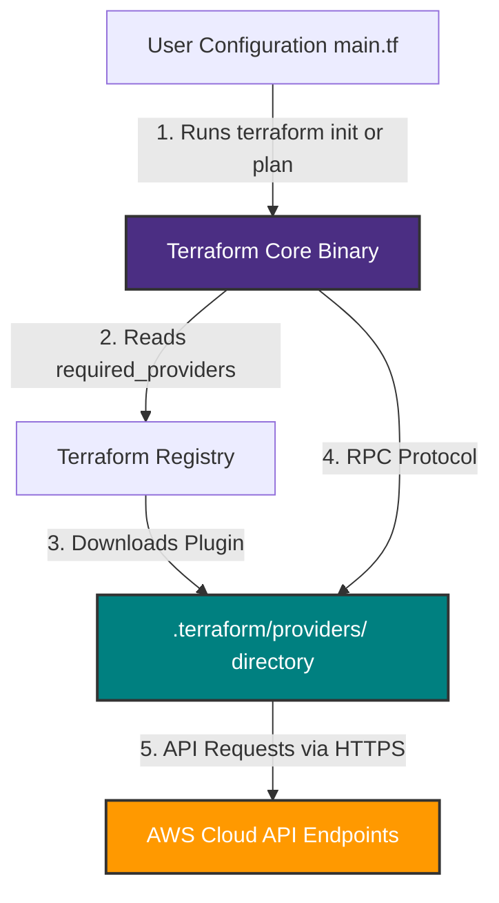
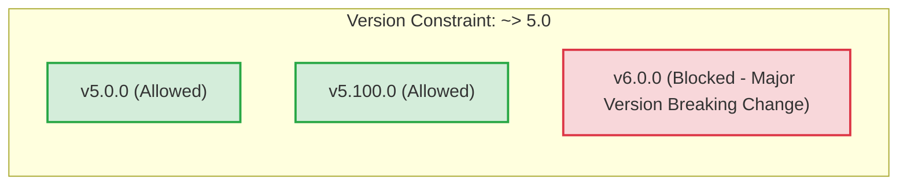

# Day 2 — Terraform Providers

> **31 Days of Terraform** — A hands-on journey to learn Terraform and Infrastructure as Code.

---

## Topics Covered

* [x] Understanding Terraform Providers
* [x] Provider Version vs Terraform Core Version
* [x] Why Provider Versioning Matters
* [x] Version Constraints & Version Operators
* [x] Configuring Required Providers & Source Addresses
* [x] Dependency Lock File (`.terraform.lock.hcl`)
* [x] Best Practices for Provider Management

---

## What are Terraform Providers?

**Providers** are executable plugins that allow Terraform to interact with cloud platforms, SaaS services, and custom APIs.

Terraform Core itself does not contain built-in code to interact with AWS, Azure, Google Cloud, or Kubernetes. Instead, Terraform uses an extensible **plugin-based architecture**:

```text
+-------------------------------------------------------------+
|                      Terraform Core                         |
|   (Parses HCL, manages state, builds dependency graph)      |
+-------------------------------------------------------------+
                              |
                     RPC Plugin Interface
                              |
       +----------------------+----------------------+
       |                                             |
       v                                             v
+-----------------------+                 +-----------------------+
|  AWS Provider Plugin  |                 | Random Provider Plugin|
+-----------------------+                 +-----------------------+
       |                                             |
       v                                             v
   AWS APIs                                   Local Operations
(EC2, S3, VPC, IAM)                      (Strings, Integers, IDs)
```

### Provider Source Addresses

Providers are hosted on the [Terraform Registry](https://registry.terraform.io/). A provider source address uses the format:

```text
[<HOSTNAME>/]<NAMESPACE>/<TYPE>
```

- **Default Hostname:** `registry.terraform.io` (omitted in standard declarations)
- **Namespace:** The organization or user publishing the provider (e.g., `hashicorp`)
- **Type:** The platform name (e.g., `aws`, `azuread`, `google`, `random`)

Example: `hashicorp/aws` expands to `registry.terraform.io/hashicorp/aws`.

---

## Provider Version vs Terraform Core Version

A common point of confusion when starting with Terraform is the difference between **Terraform Core Version** and **Provider Version**.

| Aspect | Terraform Core | Provider Version |
| :--- | :--- | :--- |
| **What is it?** | The main binary CLI executable (`terraform`) | Individual plugin downloaded during `terraform init` |
| **Responsibility** | Parses HCL files, manages `.tfstate`, calculates diffs | Translates Terraform declarations into specific API calls |
| **Release Cycle** | Independent releases (e.g., `v1.5.0`, `v1.9.0`) | Independent releases per provider (e.g., `aws v5.100.0`) |
| **Specified In** | `terraform { required_version = ">= 1.5.0" }` | `terraform { required_providers { aws = { ... } } }` |
| **Storage Location** | Installed globally on system PATH | Downloaded into local `.terraform/providers/` directory |

---

## Why Provider Versioning Matters

1. **Compatibility:** Ensures the installed provider plugin works correctly with your installed Terraform CLI binary.
2. **Stability & Immutability:** Prevents automated CI/CD pipelines from breaking when a cloud provider releases a major update.
3. **Feature Availability:** Newer provider releases introduce support for newly released cloud services, API fields, and resource types.
4. **Security & Bug Fixes:** Regular provider updates fix security vulnerabilities and API deprecations.
5. **Environment Reproducibility:** Guarantees that every engineer and build server provisions identical infrastructure using exact plugin builds.

---

## Version Constraints & Operators

Version constraints determine which plugin versions Terraform is allowed to download.

### Version Operators Summary

| Operator | Syntax Example | Meaning | Allowed Versions |
| :--- | :--- | :--- | :--- |
| `=` | `= 5.10.0` | Exact version match | Only `5.10.0` |
| `>=` | `>= 5.0` | Greater than or equal to | `5.0.0`, `5.1.0`, `6.0.0`, etc. |
| `<=` | `<= 5.50.0` | Less than or equal to | Any version up to `5.50.0` |
| `>` | `> 4.0` | Strictly greater than | Any version strictly above `4.0.0` |
| `<` | `< 6.0` | Strictly less than | Any version strictly below `6.0.0` |
| `~>` | `~> 5.0` | **Pessimistic Constraint** (allow rightmost digit to increase) | `>= 5.0.0` and `< 6.0.0` |
| `~>` | `~> 5.10.0` | **Pessimistic Constraint** (patch release lock) | `>= 5.10.0` and `< 5.11.0` |
| `,` | `>= 5.0, < 6.0` | Range constraint (combines multiple conditions) | Any version between `5.0.0` and `5.99.99` |

### Deep Dive: The Pessimistic Constraint Operator (`~>`)

The **pessimistic constraint operator** (`~>`) is recommended for production configurations because it allows minor or patch updates while protecting against breaking major version changes (Semantic Versioning `MAJOR.MINOR.PATCH`).

```text
~> 5.0    --> Allows 5.1.0, 5.100.0 (Stops before 6.0.0)
~> 5.10.0 --> Allows 5.10.1, 5.10.9 (Stops before 5.11.0)
```

---

## Dependency Lock File (`.terraform.lock.hcl`)

When you execute `terraform init`, Terraform creates a lock file named `.terraform.lock.hcl` in your working directory.

### Key Features of `.terraform.lock.hcl`:
- **Checksum Verification:** Records cryptographic hashes (SHA256) of provider plugins.
- **Cross-Platform Compatibility:** Ensures team members operating on macOS, Linux, and Windows fetch identical, verified binaries.
- **Git Tracking:** **Must be committed to Git** alongside `.tf` files.

---

## Configuration Examples

### 1. Basic Provider Configuration (`main.tf`)

```hcl
terraform {
  required_version = ">= 1.5.0"

  required_providers {
    aws = {
      source  = "hashicorp/aws"
      version = ">= 5.0"
    }
  }
}

provider "aws" {
  region = "us-east-1"
}
```

### 2. Multi-Provider Configuration with Pessimistic Constraints

```hcl
terraform {
  required_version = ">= 1.5.0"

  required_providers {
    aws = {
      source  = "hashicorp/aws"
      version = "~> 5.0"
    }
    random = {
      source  = "hashicorp/random"
      version = "~> 3.5"
    }
  }
}

provider "aws" {
  region = "us-east-1"

  default_tags {
    tags = {
      Environment = "Learning"
      ManagedBy   = "Terraform"
      Day         = "Day_02"
    }
  }
}

resource "random_string" "suffix" {
  length  = 6
  special = false
  upper   = false
}
```

---

## Day 2 Practice Checklist

* [x] Understand the plugin architecture of Terraform Providers.
* [x] Differentiate between Terraform Core version and Provider version.
* [x] Declare `required_providers` block with version constraints.
* [x] Run `terraform init` to install the AWS and Random providers.
* [x] Run `terraform validate` to verify configuration syntax.
* [x] Inspect the automatically generated `.terraform.lock.hcl` lock file.
* [x] Execute `terraform providers` to inspect the provider tree.

---

## Screenshots Needed & How to Capture Them

To complete the documentation visually, take the following screenshots and place them into the `Day_02/screenshots/` folder:

### 1. Terraform Initialization & Provider Download (`terraform-init-provider.png`)
- **Command:** `terraform init`
- **What it shows:** Terraform finding matching provider versions (`hashicorp/aws`, `hashicorp/random`), installing binaries into `.terraform/providers/`, and creating `.terraform.lock.hcl`.
- **Path:** ``

### 2. Installed Provider Tree Verification (`terraform-providers.png`)
- **Command:** `terraform providers`
- **What it shows:** Output tree displaying all providers required by the configuration along with their resolved version constraints (`hashicorp/aws ~> 5.0`, `hashicorp/random ~> 3.5`).
- **Path:** ``

### 3. Dependency Lock File View (`terraform-lockfile.png`)
- **File / Command:** `cat .terraform.lock.hcl` or opening `.terraform.lock.hcl` in VS Code / Terminal.
- **What it shows:** Provider source, version (`5.100.0`), and cryptographic hashes (`h1:...`).
- **Path:** ``

---

## Screenshots

### 1. Provider Initialization (`terraform init`)


```powershell
PS D:\terraform_for_aws\Day_02> terraform init

Initializing provider plugins...
- Finding hashicorp/aws versions matching "~> 5.0"...
- Finding hashicorp/random versions matching "~> 3.5"...
- Installing hashicorp/aws v5.100.0...
- Installed hashicorp/aws v5.100.0 (signed by HashiCorp)
- Installing hashicorp/random v3.9.0...
- Installed hashicorp/random v3.9.0 (signed by HashiCorp)

Terraform has created a lock file .terraform.lock.hcl to record the provider selections.
Terraform has been successfully initialized!
```

---

### 2. Inspecting Installed Providers (`terraform providers`)


```powershell
PS D:\terraform_for_aws\Day_02> terraform providers

Providers required by configuration:
.
├── provider[registry.terraform.io/hashicorp/aws] ~> 5.0
└── provider[registry.terraform.io/hashicorp/random] ~> 3.5
```

---

### 3. Terraform Lock File (`.terraform.lock.hcl`)


```hcl
# This file is maintained automatically by "terraform init".
# Manual edits may be lost in future updates.

provider "registry.terraform.io/hashicorp/aws" {
  version     = "5.100.0"
  hashes      = [
    "h1:...",
  ]
}
```

---

## Diagrams

### 1. Terraform Plugin Architecture & Core vs Provider Separation



### 2. Version Constraint Logic (`~>` Pessimistic Operator)



---

## Key Takeaways

* **Providers** act as translation bridges between HCL code and target service APIs.
* **Core Version** and **Provider Version** evolve independently; pinning both ensures deterministic behavior.
* Use **pessimistic operators (`~>`)** to allow non-breaking patch and minor updates while locking major versions.
* Always commit `.terraform.lock.hcl` to Git to ensure team-wide checksum verification.
* Multiple providers can be configured in a single `main.tf` file (e.g., `aws` and `random`).

---

## Commands Learned

| Command | Purpose |
| :--- | :--- |
| `terraform init` | Downloads required provider plugins and generates `.terraform.lock.hcl` |
| `terraform validate` | Checks syntax and provider configuration structure |
| `terraform providers` | Displays a visual tree of required and installed providers |
| `terraform providers lock` | Writes or updates provider checksums in the lock file for specific platforms |

---

## Resources

* [Terraform Registry](https://registry.terraform.io/)
* [AWS Provider Documentation](https://registry.terraform.io/providers/hashicorp/aws/latest/docs)
* [Terraform Provider Configuration Docs](https://developer.hashicorp.com/terraform/language/providers/configuration)
* [Dependency Lock File Guide](https://developer.hashicorp.com/terraform/language/files/dependency-lock)

---

## Day 2 Status

**Status:** Completed

**Next:** [Day 3 — S3 Bucket & AWS Authentication](../Day_03/Readme.md)
