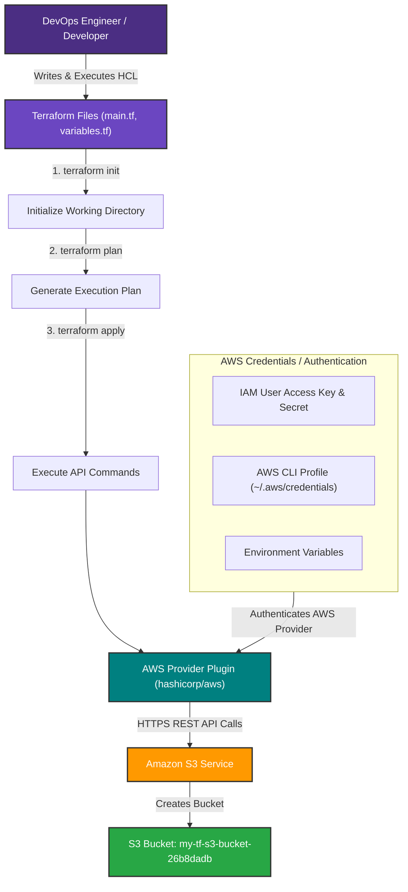
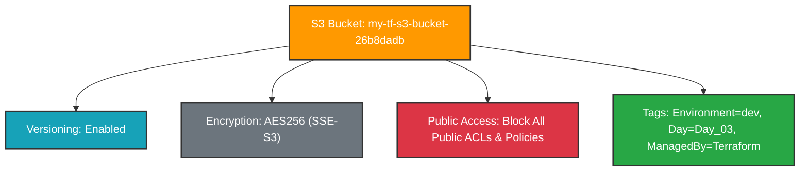

# Day 3 — AWS Authentication & S3 Bucket Management

> **31 Days of Terraform** — A hands-on journey to learn Terraform and Infrastructure as Code on AWS.

---

## Topics Covered

* [x] **Authentication and Authorization** to AWS resources
* [x] **AWS Authentication Methods** (`aws configure`, Environment Variables, IAM Roles, AWS Profiles)
* [x] **Amazon S3 Overview** (Object storage, scalability, data availability, security, performance)
* [x] **S3 Bucket Management with Terraform** (`aws_s3_bucket`, versioning, encryption, public access block)
* [x] **Globally Unique Resource Naming** with `random_id`
* [x] **Hands-on Terraform Workflow** (`init`, `validate`, `plan`, `apply`, `show`, `destroy`)
* [x] **AWS CLI Verification** (`aws sts get-caller-identity`, `aws s3 ls`)

---

## AWS Authentication & Authorization

Before Terraform can provision or manage any AWS resources, it must authenticate with the AWS APIs on your behalf. Terraform's AWS Provider automatically searches for credentials in a specific order of precedence.

### Credential Resolution Precedence

```text
+-----------------------------------------------------------------------+
| 1. Static Credentials in provider block (NOT RECOMMENDED for Git)     |
+-----------------------------------------------------------------------+
                                  |
                                  v
+-----------------------------------------------------------------------+
| 2. Environment Variables (AWS_ACCESS_KEY_ID, AWS_SECRET_ACCESS_KEY)   |
+-----------------------------------------------------------------------+
                                  |
                                  v
+-----------------------------------------------------------------------+
| 3. AWS Shared Credentials file (~/.aws/credentials or AWS_PROFILE)    |
+-----------------------------------------------------------------------+
                                  |
                                  v
+-----------------------------------------------------------------------+
| 4. IAM Role for Amazon EC2 / ECS / EKS Container Credentials         |
+-----------------------------------------------------------------------+
```

---

### Authentication Methods Summary

| Method | Best Used For | Configuration Setup | Security Level |
| :--- | :--- | :--- | :--- |
| **AWS CLI (`aws configure`)** | Local Development & Learning | Run `aws configure` in terminal | High (Stored in `~/.aws/credentials`) |
| **Environment Variables** | CI/CD Pipelines & Scripts | Set `AWS_ACCESS_KEY_ID` & `AWS_SECRET_ACCESS_KEY` | High (Avoid hardcoding in `.tf`) |
| **AWS Named Profiles** | Managing Multiple AWS Accounts | `export AWS_PROFILE=dev` or set in provider | High |
| **IAM Roles** | AWS Hosted Workers (EC2, ECS, EKS) | Automatic role delegation via Instance Metadata (IMDS) | Very High (No long-lived access keys) |

---

### Method 1: AWS CLI Configuration (Recommended for Local Dev)

The simplest way to authenticate locally is using the AWS CLI interactive prompt:

```bash
aws configure
```

Input parameters:
- **AWS Access Key ID:** `AKIA...`
- **AWS Secret Access Key:** `wJalrXUtnFEMI/K7MDENG/bPxRfiCYEXAMPLEKEY`
- **Default region name:** `us-east-1`
- **Default output format:** `json`

This writes credentials to `~/.aws/credentials` and configuration to `~/.aws/config`.

---

### Method 2: Environment Variables

Useful for CI/CD runners (GitHub Actions, GitLab CI, Jenkins):

#### Linux / macOS:
```bash
export AWS_ACCESS_KEY_ID="your-access-key-id"
export AWS_SECRET_ACCESS_KEY="your-secret-access-key"
export AWS_DEFAULT_REGION="us-east-1"
```

#### Windows (PowerShell):
```powershell
$env:AWS_ACCESS_KEY_ID="your-access-key-id"
$env:AWS_SECRET_ACCESS_KEY="your-secret-access-key"
$env:AWS_DEFAULT_REGION="us-east-1"
```

---

### Verifying AWS Authentication

To test if your AWS credentials are properly configured before running Terraform:

```bash
aws sts get-caller-identity
```

**Output:**
```json
{
    "UserId": "AIDAXXXXXXXXXXXXXXXXX",
    "Account": "123456789012",
    "Arn": "arn:aws:iam::123456789012:user/dev-user"
}
```

---

## Amazon S3 (Simple Storage Service) Deep Dive

**Amazon S3** is an object storage service offering industry-leading scalability, data availability, security, and performance.

### Key Concepts

1. **Buckets:** Top-level containers for storing objects (files).
2. **Global Naming Requirement:** S3 bucket names must be **globally unique** across all AWS accounts in all AWS regions worldwide.
3. **Objects:** Files and optional metadata stored in buckets (up to 5 TB per object).
4. **Bucket Versioning:** Keeps multiple variants of an object in the same bucket to protect against accidental deletion or overwrite.
5. **Server-Side Encryption (SSE):** Encrypts data at rest before saving it to disk (e.g., SSE-S3 / AES256 or SSE-KMS).
6. **Block Public Access:** A security boundary that prevents objects from being publicly accessible via web browsers.

---

## Terraform S3 Bucket Architecture

In modern versions of the HashiCorp AWS Provider (v4+ and v5+), S3 resources are decoupled into modular resources for better state tracking and granular configuration:

```text
┌────────────────────────────────────────────────────────────────────────┐
│                   aws_s3_bucket.demo_bucket                            │
│           (Base Bucket Resource & Name Resolution)                     │
└──────────────────────────────────┬─────────────────────────────────────┘
                                   │
       ┌───────────────────────────┼───────────────────────────┐
       ▼                           ▼                           ▼
┌─────────────────────────┐ ┌─────────────────────────┐ ┌─────────────────────────┐
│aws_s3_bucket_versioning │ │aws_s3_bucket_server_    │ │aws_s3_bucket_public_    │
│  (Enables Object        │ │  side_encryption_       │ │  access_block           │
│   Versioning)           │ │  configuration (AES256) │ │ (Blocks Public ACLs)    │
└─────────────────────────┘ └─────────────────────────┘ └─────────────────────────┘
```

---

## Terraform Configuration Code

### 1. Provider & Base Infrastructure (`main.tf`)

```hcl
# ==============================================================================
# Day 03: AWS S3 Bucket Management & Authentication
# 31 Days of Terraform (AWS)
# ==============================================================================

terraform {
  required_version = ">= 1.5.0"

  required_providers {
    aws = {
      source  = "hashicorp/aws"
      version = "~> 5.0"
    }
    random = {
      source  = "hashicorp/random"
      version = "~> 3.5"
    }
  }
}

# ------------------------------------------------------------------------------
# AWS Provider Configuration
# ------------------------------------------------------------------------------
provider "aws" {
  region = var.aws_region

  default_tags {
    tags = {
      Environment = var.environment
      ManagedBy   = "Terraform"
      Day         = "Day_03"
      Project     = "31-days-of-terraform"
    }
  }
}

# ------------------------------------------------------------------------------
# Random ID Generator for Unique Bucket Naming
# ------------------------------------------------------------------------------
resource "random_id" "bucket_suffix" {
  byte_length = 4
}

# ------------------------------------------------------------------------------
# AWS S3 Bucket Resource
# ------------------------------------------------------------------------------
resource "aws_s3_bucket" "demo_bucket" {
  bucket        = "${var.bucket_prefix}-${random_id.bucket_suffix.hex}"
  force_destroy = true

  tags = {
    Name = "${var.bucket_prefix}-${random_id.bucket_suffix.hex}"
  }
}

# ------------------------------------------------------------------------------
# S3 Bucket Versioning Configuration
# ------------------------------------------------------------------------------
resource "aws_s3_bucket_versioning" "demo_bucket_versioning" {
  bucket = aws_s3_bucket.demo_bucket.id

  versioning_configuration {
    status = "Enabled"
  }
}

# ------------------------------------------------------------------------------
# S3 Bucket Server-Side Encryption Configuration
# ------------------------------------------------------------------------------
resource "aws_s3_bucket_server_side_encryption_configuration" "demo_bucket_encryption" {
  bucket = aws_s3_bucket.demo_bucket.id

  rule {
    apply_server_side_encryption_by_default {
      sse_algorithm = "AES256"
    }
  }
}

# ------------------------------------------------------------------------------
# S3 Bucket Public Access Block (Security Best Practice)
# ------------------------------------------------------------------------------
resource "aws_s3_bucket_public_access_block" "demo_bucket_public_access" {
  bucket = aws_s3_bucket.demo_bucket.id

  block_public_acls       = true
  block_public_policy     = true
  ignore_public_acls      = true
  restrict_public_buckets = true
}
```

---

### 2. Variable Definitions (`variables.tf`)

```hcl
variable "aws_region" {
  type        = string
  default     = "us-east-1"
  description = "AWS region for deploying resources"
}

variable "environment" {
  type        = string
  default     = "dev"
  description = "Target deployment environment (e.g. dev, staging, prod)"
}

variable "bucket_prefix" {
  type        = string
  default     = "my-tf-s3-bucket"
  description = "Prefix for generating globally unique S3 bucket names"
}
```

---

### 3. Output Definitions (`outputs.tf`)

```hcl
output "s3_bucket_name" {
  description = "The globally unique name of the S3 bucket created by Terraform"
  value       = aws_s3_bucket.demo_bucket.id
}

output "s3_bucket_arn" {
  description = "The Amazon Resource Name (ARN) of the S3 bucket"
  value       = aws_s3_bucket.demo_bucket.arn
}

output "s3_bucket_region" {
  description = "The AWS Region where the S3 bucket resides"
  value       = aws_s3_bucket.demo_bucket.region
}

output "s3_bucket_domain_name" {
  description = "The bucket domain name for accessing objects"
  value       = aws_s3_bucket.demo_bucket.bucket_domain_name
}
```

---

## Practice Steps & Workflow

### 1. Verify AWS Authentication

```bash
aws sts get-caller-identity
```

### 2. Initialize Terraform Directory

```bash
terraform init
```

Downloads required provider plugins (`aws` and `random`) and generates `.terraform.lock.hcl`.

### 3. Validate Configuration

```bash
terraform validate
```

Ensures syntactical validity and correct property usage.

### 4. Create Execution Plan

```bash
terraform plan
```

Shows the 5 resources to be created without mutating cloud state.

### 5. Provision Infrastructure

```bash
terraform apply -auto-approve
```

Sends API calls to AWS to create the bucket, versioning, encryption, and public access blocks.

### 6. Verify in AWS via CLI

```bash
aws s3 ls
```

---

## Screenshots

### 1. Architectural Diagram: Create AWS S3 Bucket using Terraform


---

### 2. AWS Authentication Verification (`aws sts get-caller-identity`)


---

### 3. Terraform Initialization, Validation & Plan Initiation (`terraform init`, `validate`, `plan`)


---

### 4. Terraform Execution Plan Resource Details


---

### 5. Terraform Execution Plan Summary & Outputs Preview


---

### 6. Terraform Apply Command Execution (`terraform apply`)


---

### 7. Terraform Apply Resource Construction


---

### 8. Terraform Apply Completion & Deployed Outputs


---

### 9. AWS CLI S3 Bucket Verification (`aws s3 ls`)


---

### 10. AWS Management Console S3 Bucket Verification


---

## Diagrams

### 1. Complete Terraform AWS Provisioning Architecture



### 2. S3 Security & Feature Architecture



---

## Important Notes & Best Practices

1. **Globally Unique Bucket Names:** S3 bucket names are scoped globally across all AWS accounts. Combining a prefix with `random_id` prevents `BucketAlreadyExists` errors.
2. **Never Commit AWS Credentials:** Do not hardcode `access_key` or `secret_key` in `.tf` files. Use `aws configure` or environment variables.
3. **Security Standards:** Always block public access (`aws_s3_bucket_public_access_block`) unless serving a public website explicitly.
4. **Destroying Infrastructure:** Use `force_destroy = true` during testing so Terraform can delete non-empty buckets during `terraform destroy`.
5. **Cost Management:** Basic S3 bucket creation is free under AWS Free Tier (up to 5GB storage, 20,000 GET, 2,000 PUT requests).

---

## Commands Reference

| Command | Purpose |
| :--- | :--- |
| `aws configure` | Interactively setup AWS access key, secret key, region, and format |
| `aws sts get-caller-identity` | Verify current authenticated IAM identity and AWS account ID |
| `aws s3 ls` | List all S3 buckets in the authenticated AWS account |
| `terraform init` | Initialize backend plugins and install AWS provider |
| `terraform validate` | Verify HCL configuration file syntax |
| `terraform plan` | Preview infrastructure changes before applying |
| `terraform apply` | Provision resources on AWS cloud platform |
| `terraform show` | Inspect state file details for deployed resources |
| `terraform destroy` | Clean up and remove all provisioned resources |

---

## Troubleshooting Tips

1. **Error: `No valid credential sources found`**
   - **Fix:** Run `aws configure` or check `$env:AWS_ACCESS_KEY_ID`.
2. **Error: `BucketAlreadyExists` or `BucketAlreadyOwnedByYou`**
   - **Fix:** The bucket name is taken globally. Update `bucket_prefix` or recalculate `random_id`.
3. **Error: `InvalidAccessKeyId`**
   - **Fix:** Verify access keys in `~/.aws/credentials` or recreate credentials in IAM Console.
4. **Error: `Region mismatch`**
   - **Fix:** Ensure default region in `provider "aws"` matches your target deployment region.

---

## Day 3 Status

**Status:** Completed

**Next:** [Day 4 — State File Management & Remote Backend](../Day_04/Readme.md)
