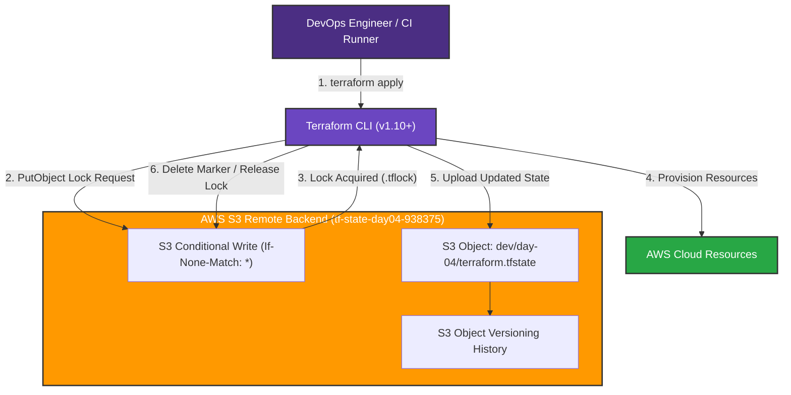
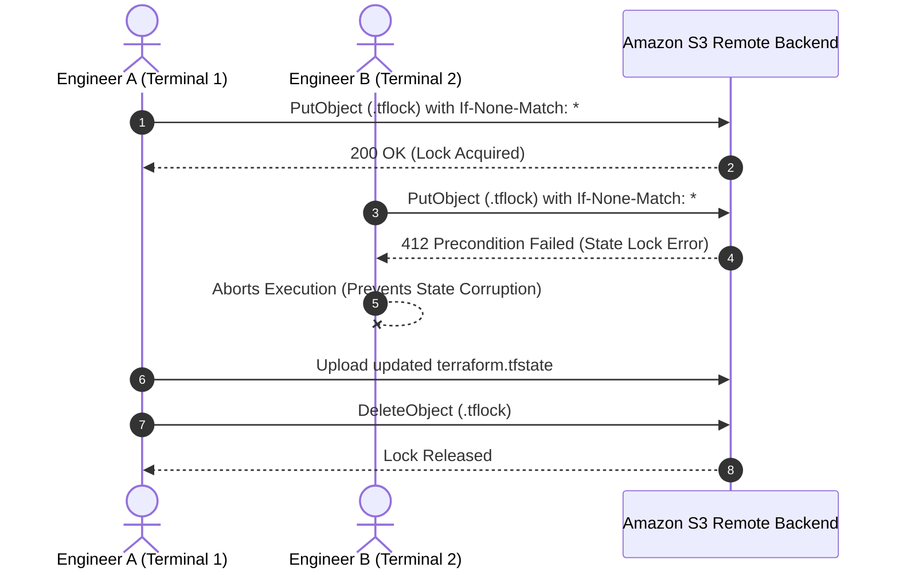

# Day 4 — State File Management & Remote Backend (S3 Native State Locking)

> **31 Days of Terraform** — A hands-on journey to learn Terraform and Infrastructure as Code on AWS.

---

## Topics Covered

* [x] **How Terraform Updates Infrastructure** (Desired State vs. Actual State)
* [x] **Terraform State File (`terraform.tfstate`)** Structure & Metadata
* [x] **State File Best Practices** (Remote storage, encryption, access control)
* [x] **Remote Backend Setup with Amazon S3**
* [x] **S3 Native State Locking (`use_lockfile = true`)** introduced in Terraform 1.10+ (No DynamoDB required!)
* [x] **Backend Migration Workflow** (`terraform init -migrate-state`)
* [x] **State Management CLI Commands** (`state list`, `state show`, `state mv`, `state rm`, `state pull`, `force-unlock`)
* [x] **Security Considerations & Audit Logging** (S3 Bucket Policies, Server-Side Encryption, Versioning, CloudTrail)

---

## How Terraform Updates Infrastructure

Terraform operates on a **declarative paradigm**, continuously aligning **Actual State** (the real cloud resources running in AWS) with **Desired State** (the `.tf` configuration files written by DevOps engineers).

```text
┌──────────────────────────────┐              ┌──────────────────────────────┐
│        Desired State         │              │         Actual State         │
│  (HCL Configuration Files)   │              │   (Live AWS Infrastructure)  │
└──────────────┬───────────────┘              └──────────────┬───────────────┘
               │                                             │
               │               ┌──────────────┐              │
               └──────────────►│ State File   │◄─────────────┘
                               │ (.tfstate)   │
                               └──────────────┘
```

### The Update Workflow

1. **State Refresh (`terraform refresh` / `plan`):** Terraform queries cloud APIs to inspect real-world resources and updates the state file mapping.
2. **Diff Calculation:** Terraform compares the updated state mapping against the desired configuration.
3. **Targeted Execution:** Terraform calculates the minimal set of changes (Add, Change, Destroy) needed to achieve the target state without touching unmodified resources.

---

## Terraform State File (`terraform.tfstate`)

The state file is a JSON document that acts as the single source of truth binding your HCL code to real-world cloud resource IDs.

### What the State File Contains:
- **Resource Metadata & IDs:** Maps Terraform resource addresses (e.g. `aws_s3_bucket.app_data`) to physical AWS identifiers (e.g. `arn:aws:s3:::app-data-day04-4ede1cee`).
- **Resource Attributes & Dependencies:** Complete property graphs including generated tokens, IPs, and implicit dependency trees.
- **Provider References:** Plugin versions and schemas used during deployment.

---

## State File Best Practices

1. **Never Edit the State File Manually:** Direct edits can corrupt the JSON schema or create drift, breaking future `terraform plan` operations.
2. **Store State Remotely:** Never commit `.tfstate` files to Git repositories. Use a remote backend (e.g. Amazon S3).
3. **Enable State Locking:** Protect against race conditions and concurrent `terraform apply` runs by multiple engineers.
4. **Enable Versioning on the Backend Bucket:** Allows rollback in case of state corruption.
5. **Encrypt at Rest & in Transit:** State files contain sensitive outputs (e.g. private keys, connection strings). Enable S3 Server-Side Encryption (`encrypt = true`).
6. **Isolate Environments:** Maintain distinct state keys/paths for `dev`, `staging`, and `prod` environments.

---

## S3 Native State Locking (`use_lockfile = true`)

### Deep Dive: Terraform 1.10+ S3 Native Locking vs. Legacy DynamoDB Locking

Prior to **Terraform 1.10** (released in 2024), state locking on AWS required creating a separate **Amazon DynamoDB table** alongside an S3 bucket.

Starting with **Terraform 1.10+** (and recommended GA in **1.11+**), Terraform natively supports **S3 Conditional Writes** (using the HTTP `If-None-Match` header).

```text
┌────────────────────────────────────────────────────────────────────────┐
│                        LEGACY DYNAMODB METHOD                          │
│                                                                        │
│   S3 Bucket (Stores State)   +   DynamoDB Table (Manages Locks)        │
│   • Extra AWS Service            • Extra Cost & Provisioned Throughput │
│   • Complex IAM Policies         • Prone to Lock Drift                 │
└────────────────────────────────────────────────────────────────────────┘
                                    │
                                    ▼
┌────────────────────────────────────────────────────────────────────────┐
│                  MODERN S3 NATIVE LOCKING (TF 1.10+)                   │
│                                                                        │
│   S3 Bucket ONLY (Stores State AND Handles State Locking Natively)     │
│   • Simple Setup (`use_lockfile = true`)                               │
│   • Zero DynamoDB Overhead & Costs                                     │
│   • Uses S3 Conditional Writes (`If-None-Match`)                       │
└────────────────────────────────────────────────────────────────────────┘
```

### How S3 Native State Locking Works

1. **Lock Acquisition:** When Terraform runs (`plan`, `apply`, `destroy`), it sends an S3 `PutObject` request with an `If-None-Match: *` header to create a lock file (`.tflock`) in the bucket.
2. **Atomic Collision Prevention:** If another process is running, the S3 PutObject request returns HTTP `412 Precondition Failed`. Terraform stops execution immediately with a state lock error.
3. **Lock Release:** Upon successful completion, Terraform deletes the lock file from S3.

---

## Terraform Remote Backend Configuration

### HCL Backend Declaration (`main.tf`)

```hcl
terraform {
  required_version = ">= 1.10.0"

  required_providers {
    aws = {
      source  = "hashicorp/aws"
      version = "~> 5.0"
    }
    random = {
      source  = "hashicorp/random"
      version = "~> 3.5"
    }
  }

  # S3 Remote Backend with Native State Locking
  backend "s3" {
    bucket       = "tf-state-day04-938375"
    key          = "dev/day-04/terraform.tfstate"
    region       = "us-east-1"
    use_lockfile = true # Enables S3 Native Conditional-Write State Locking
    encrypt      = true # Server-side encryption at rest
  }
}
```

---

## Complete HCL Configuration Files

### 1. `main.tf`

```hcl
# ==============================================================================
# Day 04: State File Management & Remote Backend (S3 Native State Locking)
# 31 Days of Terraform (AWS)
# ==============================================================================

terraform {
  required_version = ">= 1.10.0"

  required_providers {
    aws = {
      source  = "hashicorp/aws"
      version = "~> 5.0"
    }
    random = {
      source  = "hashicorp/random"
      version = "~> 3.5"
    }
  }

  backend "s3" {
    bucket       = "tf-state-day04-938375"
    key          = "dev/day-04/terraform.tfstate"
    region       = "us-east-1"
    use_lockfile = true
    encrypt      = true
  }
}

provider "aws" {
  region = var.aws_region

  default_tags {
    tags = {
      Environment = var.environment
      ManagedBy   = "Terraform"
      Day         = "Day_04"
      Project     = var.project_name
    }
  }
}

resource "random_id" "app_suffix" {
  byte_length = 4
}

resource "aws_s3_bucket" "app_data" {
  bucket        = "app-data-day04-${random_id.app_suffix.hex}"
  force_destroy = true

  tags = {
    Name = "app-data-day04-${random_id.app_suffix.hex}"
  }
}

resource "aws_s3_bucket_versioning" "app_data_versioning" {
  bucket = aws_s3_bucket.app_data.id

  versioning_configuration {
    status = "Enabled"
  }
}

resource "aws_s3_bucket_server_side_encryption_configuration" "app_data_encryption" {
  bucket = aws_s3_bucket.app_data.id

  rule {
    apply_server_side_encryption_by_default {
      sse_algorithm = "AES256"
    }
  }
}

resource "aws_s3_bucket_public_access_block" "app_data_public_access" {
  bucket = aws_s3_bucket.app_data.id

  block_public_acls       = true
  block_public_policy     = true
  ignore_public_acls      = true
  restrict_public_buckets = true
}
```

### 2. `variables.tf`

```hcl
variable "aws_region" {
  type        = string
  default     = "us-east-1"
  description = "AWS region for deploying resources"
}

variable "environment" {
  type        = string
  default     = "dev"
  description = "Target deployment environment"
}

variable "project_name" {
  type        = string
  default     = "31-days-of-terraform"
  description = "Project identifier for resource tagging"
}
```

### 3. `outputs.tf`

```hcl
output "sample_bucket_id" {
  description = "The name of the sample S3 bucket managed via remote state"
  value       = aws_s3_bucket.app_data.id
}

output "sample_bucket_arn" {
  description = "The ARN of the sample S3 bucket managed via remote state"
  value       = aws_s3_bucket.app_data.arn
}

output "random_suffix_hex" {
  description = "The hex string generated for unique naming"
  value       = random_id.app_suffix.hex
}
```

---

## Step-by-Step Hands-on Practice Guide

### Step 1: Create the Remote State Bucket with AWS CLI

Run the following commands in terminal to prepare the S3 backend bucket with versioning and encryption:

```powershell
aws s3api create-bucket --bucket tf-state-day04-938375 --region us-east-1
aws s3api put-bucket-versioning --bucket tf-state-day04-938375 --versioning-configuration Status=Enabled
aws s3api put-bucket-encryption --bucket tf-state-day04-938375 --server-side-encryption-configuration '{"Rules":[{"ApplyServerSideEncryptionByDefault":{"SSEAlgorithm":"AES256"}}]}'
aws s3api put-public-access-block --bucket tf-state-day04-938375 --public-access-block-configuration "BlockPublicAcls=true,IgnorePublicAcls=true,BlockPublicPolicy=true,RestrictPublicBuckets=true"
```

### Step 2: Initialize Remote Backend

```bash
terraform init
```

**Output:**
```text
Initializing the backend...

Successfully configured the backend "s3"! Terraform will automatically
use this backend unless the backend configuration changes.

Initializing provider plugins...
- Finding hashicorp/aws versions matching "~> 5.0"...
- Finding hashicorp/random versions matching "~> 3.5"...
- Installing hashicorp/aws v5.100.0...
- Installed hashicorp/aws v5.100.0 (signed by HashiCorp)

Terraform has been successfully initialized!
```

### Step 3: Plan and Apply Infrastructure

```bash
terraform plan
terraform apply -auto-approve
```

During apply, observe the lock acquisition and release log messages:
```text
Releasing state lock. This may take a few moments...
Apply complete! Resources: 5 added, 0 changed, 0 destroyed.

Outputs:

random_suffix_hex = "4ede1cee"
sample_bucket_arn = "arn:aws:s3:::app-data-day04-4ede1cee"
sample_bucket_id = "app-data-day04-4ede1cee"
```

### Step 4: Verify Remote State Storage in S3 via CLI

```bash
aws s3 ls s3://tf-state-day04-938375/dev/day-04/
```

**Output:**
```text
2026-09-07 22:54:55       6611 terraform.tfstate
```

---

## State Management CLI Commands Reference

Terraform provides a dedicated suite of subcommands to safely inspect and manipulate state without editing raw JSON files:

| Command | Description | Example Usage |
| :--- | :--- | :--- |
| `terraform state list` | Lists all resource addresses currently tracked in the state file | `terraform state list` |
| `terraform state show` | Displays detailed attribute values for a specific resource address | `terraform state show aws_s3_bucket.app_data` |
| `terraform state pull` | Downloads raw JSON state content from remote backend to stdout | `terraform state pull > state_backup.json` |
| `terraform state mv` | Renames or moves a resource in state without destroying infrastructure | `terraform state mv aws_s3_bucket.app_data aws_s3_bucket.main_data` |
| `terraform state rm` | Removes a resource from state tracking (resource remains running in AWS) | `terraform state rm aws_s3_bucket.app_data` |
| `terraform force-unlock` | Manually releases a stuck lock ID if a process crashes abruptly | `terraform force-unlock <lock-id>` |

### Verification of `terraform state list` Command Output:

```text
aws_s3_bucket.app_data
aws_s3_bucket_public_access_block.app_data_public_access
aws_s3_bucket_server_side_encryption_configuration.app_data_encryption
aws_s3_bucket_versioning.app_data_versioning
random_id.app_suffix
```

---

## Diagrams

### 1. Remote State Architecture & S3 Native Locking



### 2. State Lock Collision Prevention Workflow



---

## Security Considerations & Best Practices

1. **Restricted Bucket Access:** Apply strict S3 bucket policies allowing access only to specific IAM roles or developers.
2. **Enforce Transit Encryption:** Add an S3 bucket policy condition requiring `aws:SecureTransport: true` (HTTPS only).
3. **Enable CloudTrail Data Events:** Enable AWS CloudTrail auditing on the remote state bucket to track who accessed or modified state objects.
4. **Minimal IAM Permissions:** Grant read/write access to `s3:GetObject`, `s3:PutObject`, `s3:DeleteObject`, and `s3:ListBucket` on the backend bucket path.

---

## Common Issues & Troubleshooting

1. **Error `StatusCode: 412` (State Lock Error):**
   - **Cause:** Another team member or pipeline is actively running Terraform, or a previous run crashed before releasing the lock.
   - **Fix:** Wait for the running operation to complete. If confirmed crashed, run `terraform force-unlock <lock-id>`.
2. **Error `S3 versioning must be enabled`:**
   - **Cause:** S3 native locking requires versioning to manage lock markers reliably.
   - **Fix:** Enable versioning on the S3 bucket using `aws s3api put-bucket-versioning`.
3. **Error `Terraform version mismatch`:**
   - **Cause:** `use_lockfile = true` requires Terraform Core version 1.10.0 or higher.
   - **Fix:** Upgrade Terraform CLI (`terraform version`).

---

## Day 4 Status

**Status:** Completed

**Next:** Day 5 — Terraform Variables, Input Types & Validation Rules
