# Day 5 — Terraform Variables (Input, Local & Output Variables)

> **31 Days of Terraform** — A hands-on journey to learn Terraform and Infrastructure as Code on AWS.

---

## Topics Covered

* [x] **The 3 Types of Terraform Variables** (Input Variables, Local Values, Output Variables)
* [x] **Input Variables (`variables.tf`)** — Structure, data types, default values, and parameterization
* [x] **Local Values (`locals.tf`)** — Computed values, dynamic string interpolation, and reusable maps
* [x] **Output Variables (`output.tf`)** — Querying and returning deployed resource attributes
* [x] **Variable Precedence Hierarchy** — Understanding how Terraform resolves conflicting variable values
* [x] **Passing Variable Values** — via `terraform.tfvars`, `-var` CLI flags, `-var-file`, and `TF_VAR_` environment variables
* [x] **Hands-on Precedence Testing** — Practical multi-environment overrides (defaults, tfvars, CLI, environment variables)

---

## 🎯 The Three Types of Terraform Variables

Terraform classifies variables into three distinct categories based on their lifecycle, scope, and purpose:

```text
┌───────────────────────────┐      ┌───────────────────────────┐      ┌───────────────────────────┐
│     INPUT VARIABLES       │      │       LOCAL VALUES        │      │     OUTPUT VARIABLES      │
│      (variables.tf)       │      │        (locals.tf)        │      │        (output.tf)        │
├───────────────────────────┤      ├───────────────────────────┤      ├───────────────────────────┤
│ External parameters       │      │ Internal computed values  │      │ Return values displayed   │
│ passed into Terraform     │ ───► │ transformed inside HCL    │ ───► │ after execution           │
│ (Like function arguments) │      │ (Like local variables)    │      │ (Like return statements)  │
└───────────────────────────┘      └───────────────────────────┘      └───────────────────────────┘
```

### Side-by-Side Comparison

| Feature | Input Variables (`var.<name>`) | Local Values (`local.<name>`) | Output Variables (`output "<name>"`) |
| :--- | :--- | :--- | :--- |
| **Purpose** | Parameterize and customize configs | Calculate and reuse intermediate values | Expose attributes after deployment |
| **Declaration Block** | `variable "environment" {}` | `locals {}` | `output "bucket_arn" {}` |
| **Origin** | Provided by user/CLI/tfvars/defaults | Computed internally within HCL code | Extracted from created cloud resources |
| **Overridable?** | ✅ Yes (via CLI, `.tfvars`, Env vars) | ❌ No (calculated automatically) | ❌ No (derived post-apply) |
| **Analogy** | Function parameters / arguments | Internal local variables in code | Function `return` values |

---

## 📥 1. Input Variables in Detail (`variables.tf`)

Input variables allow you to write reusable, modular Terraform code without hardcoding values (such as bucket prefixes, environment names, or AWS regions).

### Basic Syntax
```hcl
variable "variable_name" {
  description = "Detailed purpose of this variable"
  type        = string            # string, number, bool, list, map, object
  default     = "default_value"   # Optional default fallback
  sensitive   = false             # Optional: hides value from console logs
}
```

### Reference Syntax
Inside `.tf` configuration files, input variables are accessed using the `var.` prefix:
```hcl
resource "aws_s3_bucket" "demo" {
  bucket = var.bucket_name
}
```

---

## ⚙️ 2. Local Values in Detail (`locals.tf`)

Local values (`locals`) assign a name to an expression, avoiding repetitive code and computing dynamic values from input variables and resource attributes.

### Why Use Local Values?
- **DRY (Don't Repeat Yourself):** Define common tags or prefixes once and reuse everywhere.
- **Computed Expressions:** Dynamically combine input variables with random strings or timestamps.

### Basic Syntax
```hcl
locals {
  common_tags = {
    Environment = var.environment
    Project     = "Terraform-Demo"
    ManagedBy   = "Terraform"
    Day         = "Day_05"
  }

  full_bucket_name = "${var.environment}-${var.bucket_name}-${random_string.suffix.result}"
}
```

### Reference Syntax
Inside `.tf` configuration files, local values are accessed using the `local.` prefix:
```hcl
resource "aws_s3_bucket" "demo" {
  bucket = local.full_bucket_name
  tags   = local.common_tags
}
```

---

## 📤 3. Output Variables in Detail (`output.tf`)

Output variables export key information after infrastructure is created. They allow DevOps engineers to inspect IDs, ARNs, endpoints, or pass values to external systems and CI/CD pipelines.

### Basic Syntax
```hcl
output "bucket_name" {
  description = "Name of the created S3 bucket"
  value       = aws_s3_bucket.demo.bucket
}

output "bucket_arn" {
  description = "ARN of the S3 bucket"
  value       = aws_s3_bucket.demo.arn
}

output "environment" {
  description = "Environment from input variable"
  value       = var.environment
}

output "tags" {
  description = "Tags from local variable"
  value       = local.common_tags
}
```

### Querying Outputs via CLI
```bash
terraform output                 # Print all declared outputs
terraform output bucket_name     # Print a specific output
terraform output -raw bucket_arn # Print raw string (ideal for scripts)
terraform output -json           # Print outputs formatted in JSON
```

---

## ⚖️ Variable Precedence Hierarchy

When the same input variable is defined in multiple places, Terraform resolves conflicts using a strict precedence order (**highest priority wins**):

```text
┌─────────────────────────────────────────────────────────────────────────┐
│ 1. Command-line Flags (-var and -var-file)          [HIGHEST PRECEDENCE]│
├─────────────────────────────────────────────────────────────────────────┤
│ 2. *.auto.tfvars or *.auto.tfvars.json (alphabetical)                   │
├─────────────────────────────────────────────────────────────────────────┤
│ 3. terraform.tfvars or terraform.tfvars.json (auto-loaded)              │
├─────────────────────────────────────────────────────────────────────────┤
│ 4. Environment Variables (TF_VAR_<variable_name>)                       │
├─────────────────────────────────────────────────────────────────────────┤
│ 5. Default Values declared in variables.tf           [LOWEST PRECEDENCE]│
└─────────────────────────────────────────────────────────────────────────┘
```

---

## 📁 Complete Configuration Code

### 1. `provider.tf`
```hcl
terraform {
  required_version = ">= 1.5.0"

  required_providers {
    aws = {
      source  = "hashicorp/aws"
      version = "~> 5.0"
    }
    random = {
      source  = "hashicorp/random"
      version = "~> 3.5"
    }
  }
}

provider "aws" {
  region = var.aws_region
}
```

### 2. `variables.tf`
```hcl
variable "aws_region" {
  description = "AWS deployment region"
  type        = string
  default     = "us-east-1"
}

variable "environment" {
  description = "Target deployment environment (e.g. dev, staging, prod, demo)"
  type        = string
  default     = "staging"
}

variable "bucket_name" {
  description = "Base name for the S3 bucket"
  type        = string
  default     = "my-terraform-bucket"
}
```

### 3. `locals.tf`
```hcl
locals {
  common_tags = {
    Environment = var.environment
    Project     = "Terraform-Demo"
    ManagedBy   = "Terraform"
    Day         = "Day_05"
  }

  full_bucket_name = "${var.environment}-${var.bucket_name}-${random_string.suffix.result}"
}
```

### 4. `main.tf`
```hcl
resource "random_string" "suffix" {
  length  = 6
  special = false
  upper   = false
}

resource "aws_s3_bucket" "demo" {
  bucket        = local.full_bucket_name
  force_destroy = true

  tags = local.common_tags
}

resource "aws_s3_bucket_versioning" "demo_versioning" {
  bucket = aws_s3_bucket.demo.id

  versioning_configuration {
    status = "Enabled"
  }
}

resource "aws_s3_bucket_server_side_encryption_configuration" "demo_encryption" {
  bucket = aws_s3_bucket.demo.id

  rule {
    apply_server_side_encryption_by_default {
      sse_algorithm = "AES256"
    }
  }
}

resource "aws_s3_bucket_public_access_block" "demo_public_access" {
  bucket = aws_s3_bucket.demo.id

  block_public_acls       = true
  block_public_policy     = true
  ignore_public_acls      = true
  restrict_public_buckets = true
}
```

### 5. `output.tf`
```hcl
output "bucket_name" {
  description = "Name of the S3 bucket"
  value       = aws_s3_bucket.demo.bucket
}

output "bucket_arn" {
  description = "ARN of the S3 bucket"
  value       = aws_s3_bucket.demo.arn
}

output "environment" {
  description = "Environment from input variable"
  value       = var.environment
}

output "tags" {
  description = "Tags from local variable"
  value       = local.common_tags
}
```

### 6. `terraform.tfvars`
```hcl
environment = "demo"
bucket_name = "terraform-demo-bucket"
```

### 7. `dev.tfvars` & `prod.tfvars`
```hcl
# dev.tfvars
environment = "development"
bucket_name = "dev-app-storage"

# prod.tfvars
environment = "production"
bucket_name = "prod-app-storage"
```

---

## 🧪 Hands-On Practice: Variable Precedence Testing

### Test 1: Default Values
Temporarily hide `terraform.tfvars` to test fallback to defaults declared in `variables.tf`:
```bash
# Rename tfvars
mv terraform.tfvars terraform.tfvars.backup
terraform plan
# Uses: environment = "staging", bucket_name = "my-terraform-bucket"
mv terraform.tfvars.backup terraform.tfvars
```

### Test 2: Automatically Loaded `terraform.tfvars`
```bash
terraform plan
# Uses: environment = "demo", bucket_name = "terraform-demo-bucket"
```

### Test 3: Environment Variable Override (`TF_VAR_`)
```bash
# PowerShell
$env:TF_VAR_environment="staging-from-env"
terraform plan
# Overrides terraform.tfvars -> environment = "staging-from-env"
$env:TF_VAR_environment=$null
```

### Test 4: Command-Line Flag Override (`-var`) (Highest Precedence)
```bash
terraform plan -var="environment=production" -var="bucket_name=production-critical-storage"
# Overrides tfvars and env vars -> environment = "production"
```

### Test 5: Custom Variable Files (`-var-file`)
```bash
terraform plan -var-file="dev.tfvars"
terraform plan -var-file="prod.tfvars"
```

---

## Screenshots

### 1. Terraform Plan with Default Variables & tfvars (Initiation)
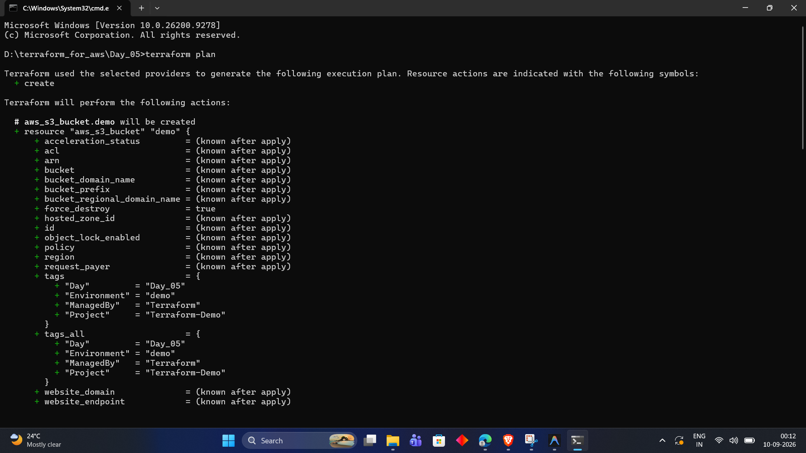

---

### 2. Terraform Plan Resource Evaluation (S3 Bucket & Attributes)
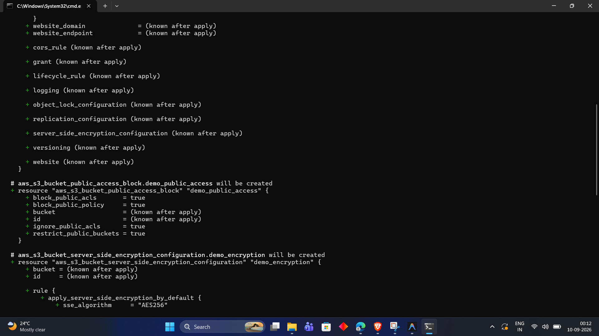

---

### 3. Terraform Plan Outputs Preview (Tags, Bucket Name, Environment)
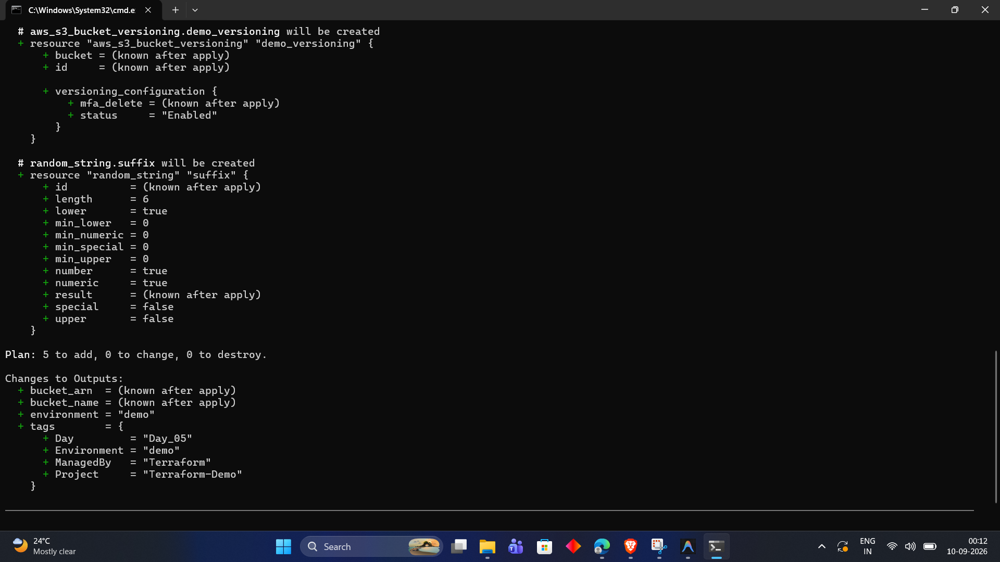

---

### 4. Terraform Plan with CLI Override Flag (`-var="environment=production"`)


---

### 5. CLI Variable Override Resource Plan Evaluation


---

### 6. CLI Variable Override Outputs Preview
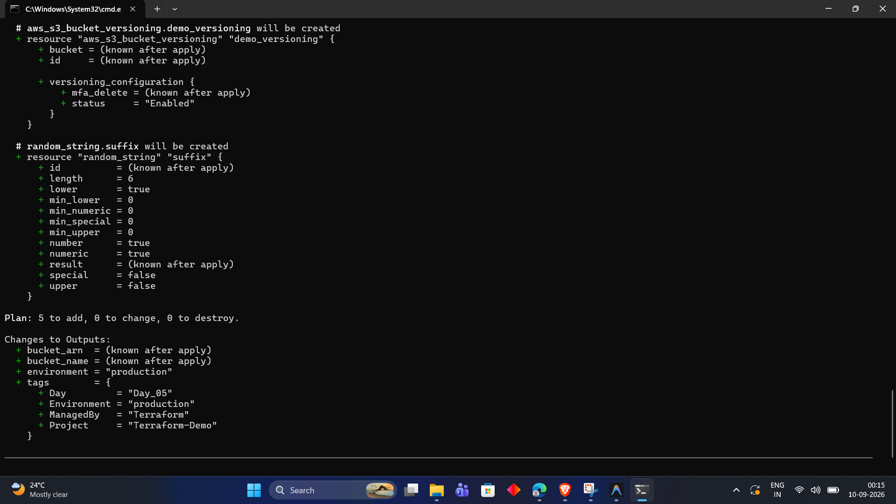

---

### 7. Terraform Apply Execution Initiation
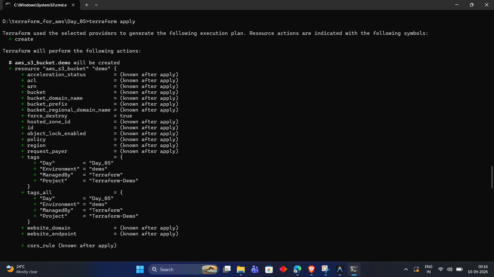

---

### 8. Terraform Apply Resource Construction Details
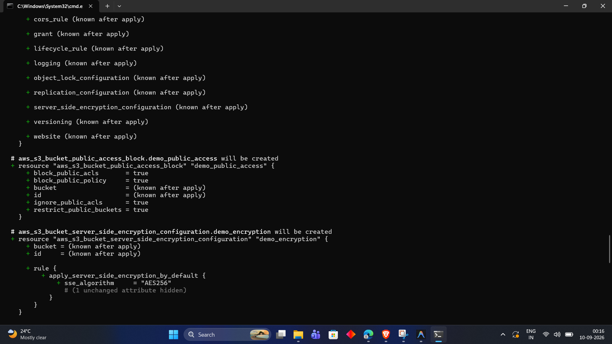

---

### 9. Terraform Apply Confirmation Prompt (`yes`)
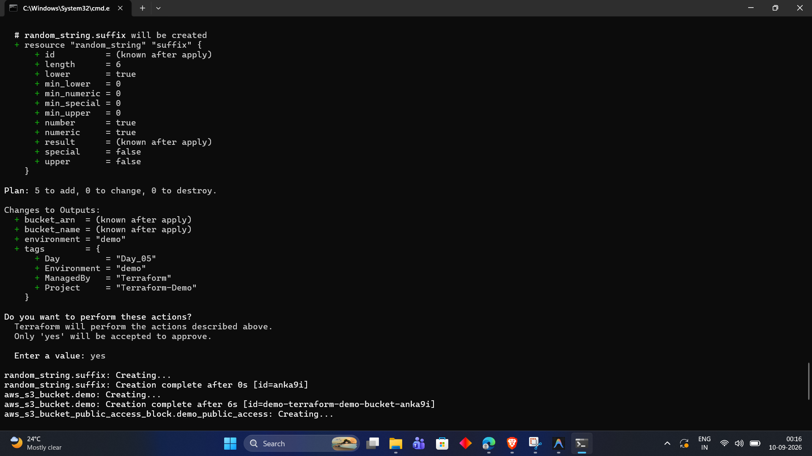

---

### 10. Terraform Apply Completion & Displayed Output Values
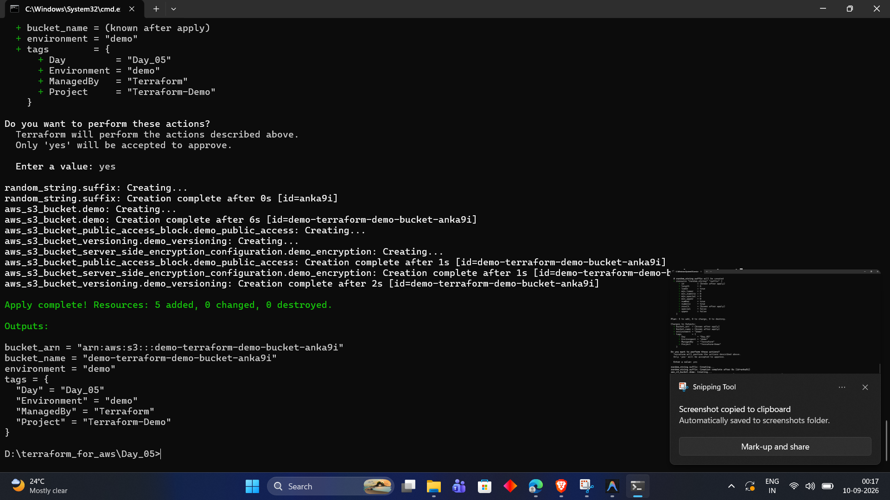

---

### 11. Querying Terraform Outputs (`terraform output`)
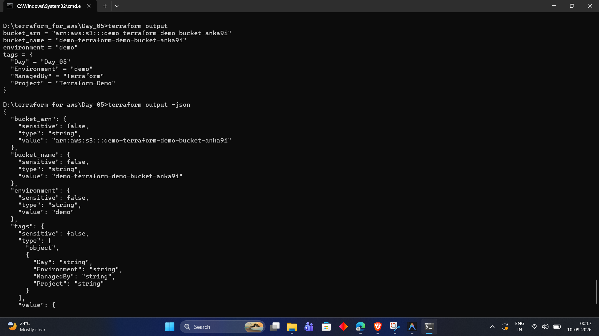

---

### 12. Querying Terraform Outputs in JSON Format (`terraform output -json`)
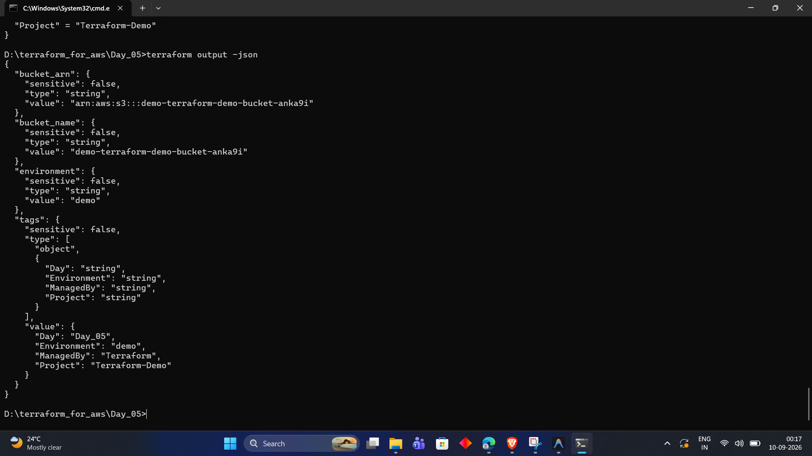

---

## 📊 Diagrams

### 1. Variables Data Flow in Terraform

```mermaid
flowchart LR
    subgraph Inputs ["1. Inputs (variables.tf / .tfvars)"]
        V1["var.environment: 'demo'"]
        V2["var.bucket_name: 'demo-bucket'"]
    end

    subgraph Locals ["2. Locals (locals.tf)"]
        L1["local.common_tags: Map"]
        L2["local.full_bucket_name: Computed String"]
    end

    subgraph Resources ["3. Resources (main.tf)"]
        R1["aws_s3_bucket.demo"]
    end

    subgraph Outputs ["4. Outputs (output.tf)"]
        O1["output.bucket_name"]
        O2["output.bucket_arn"]
        O3["output.tags"]
    end

    Inputs --> Locals
    Locals --> Resources
    Resources --> Outputs

    style Inputs fill:#4B2E83,stroke:#333,stroke-width:2px,color:#fff
    style Locals fill:#008080,stroke:#333,stroke-width:2px,color:#fff
    style Resources fill:#FF9900,stroke:#333,stroke-width:2px,color:#fff
    style Outputs fill:#28A745,stroke:#333,stroke-width:2px,color:#fff
```

### 2. Variable Precedence Ladder

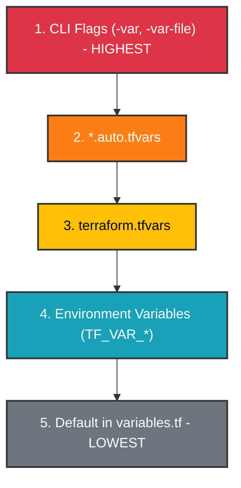

---

## 💡 Key Takeaways

1. **Input Variables (`var.*`):** Function parameters that make configurations reusable across environments without code duplication.
2. **Local Values (`local.*`):** Reusable computed expressions that simplify HCL maintenance.
3. **Output Variables (`output.*`):** Expose critical attributes post-deployment for verification or external orchestration.
4. **Precedence Rule:** Command line (`-var`) > `.tfvars` > `TF_VAR_` environment variables > defaults in `variables.tf`.

---

## Day 5 Status

**Status:** Completed

**Next:** Day 6 — Terraform Outputs & State Querying
