# Day 06 — Terraform File Structure & Code Organization

> **31 Days of Terraform (AWS)** — A hands-on journey to master Terraform and Infrastructure as Code on AWS.

---

## Topics Covered

* [x] **Terraform File Organization** — Splitting monolithic code into clean, manageable, domain-specific `.tf` files
* [x] **Sequence of File Loading** — How Terraform parses, merges, and resolves dependencies across files
* [x] **File Organization Principles** — Separation of concerns, logical grouping, naming conventions, and size management
* [x] **Standard vs. Advanced Directory Structures** — Flat structures, Environment-based directories, and Service-based architectures
* [x] **Hands-on Practice** — Reorganizing an AWS infrastructure project (VPC, Subnets, IGW, Route Tables, S3, Random ID, Outputs) across separate `.tf` files
* [x] **Validation & Best Practices** — Linting, formatting (`terraform fmt`), validating (`terraform validate`), and avoiding common anti-patterns

---

## 🏗️ 1. Terraform File Loading Mechanism

When Terraform runs in a working directory:

1. **Loads All `.tf` Files**: Terraform reads all files with the `.tf` extension in the root execution directory (subdirectories are ignored unless called as modules).
2. **Lexicographical (Alphabetical) Reading**: Files are read into memory in alphabetical order (e.g., `backend.tf` $\rightarrow$ `locals.tf` $\rightarrow$ `outputs.tf` $\rightarrow$ `provider.tf` $\rightarrow$ `storage.tf` $\rightarrow$ `variables.tf` $\rightarrow$ `vpc.tf`).
3. **Merged into a Single Abstract Syntax Tree (AST)**: Terraform treats all `.tf` files in the current folder as a **single unified configuration**.
4. **Dependency Graph Construction**: The order of files **does not determine** resource creation order. Terraform builds an internal Directed Acyclic Graph (DAG) based on explicit (`depends_on`) and implicit resource references (e.g., `aws_vpc.main.id`).

```text
Working Directory (.tf files)
┌──────────────┐  ┌──────────────┐  ┌──────────────┐  ┌──────────────┐
│  backend.tf  │  │ provider.tf  │  │ variables.tf │  │  locals.tf   │
└──────┬───────┘  └──────┬───────┘  └──────┬───────┘  └──────┬───────┘
       │                 │                 │                 │
┌──────┴───────┐  ┌──────┴───────┐  ┌──────┴───────┐         │
│    vpc.tf    │  │  storage.tf  │  │  outputs.tf  │         │
└──────┬───────┘  └──────┬───────┘  └──────┬───────┘         │
       │                 │                 │                 │
       ▼                 ▼                 ▼                 ▼
 ═════════════════════════════════════════════════════════════════════
          Terraform Engine: Merged Unified Configuration
 ═════════════════════════════════════════════════════════════════════
                                │
                                ▼
               Dependency Graph (Directed Acyclic Graph)
                   [aws_vpc] ──► [aws_subnet] ──► ...
                                │
                                ▼
                       Execution Plan / Apply
```

---

## 📁 2. Recommended File Structure

For standard single-environment or root-module infrastructure, follow this industry-standard structure:

```text
Day_06/
├── backend.tf               # Terraform core & remote backend configuration
├── provider.tf              # Provider declarations and provider-level default tags
├── variables.tf             # Input variable declarations with types & validations
├── locals.tf                # Computed local values, naming prefixes, and random IDs
├── vpc.tf                   # Networking: VPC, subnets, IGW, route tables
├── storage.tf               # Storage: S3 buckets, versioning, encryption, access blocks
├── outputs.tf               # Output definitions returned to the user/console
├── terraform.tfvars         # Active variable value assignments (gitignored if sensitive)
├── terraform.tfvars.example # Safe template showing expected variable structure
└── Readme.md                # Documentation and architectural guide
```

### Purpose of Each File

| File Name | Purpose | What Belongs Inside |
| :--- | :--- | :--- |
| `backend.tf` | Backend & Version Constraints | `terraform { required_version, required_providers, backend }` |
| `provider.tf` | Provider Configuration | `provider "aws" {}`, aliases, region settings, `default_tags` |
| `variables.tf` | Input Parameters | `variable "<name>" {}` definitions, type constraints, validations |
| `locals.tf` | Internal Computed Values | `locals {}` blocks, naming conventions, helper tags |
| `vpc.tf` | Networking Resources | `aws_vpc`, `aws_subnet`, `aws_route_table`, `aws_internet_gateway` |
| `storage.tf` | Storage Resources | `aws_s3_bucket`, `aws_ebs_volume`, encryption & access configurations |
| `security.tf` | Security Controls | `aws_security_group`, `aws_network_acl`, `aws_iam_*` |
| `compute.tf` | Compute Workloads | `aws_instance`, `aws_launch_template`, `aws_autoscaling_group` |
| `database.tf` | Database Engines | `aws_db_instance`, `aws_dynamodb_table`, `aws_elasticache_cluster` |
| `outputs.tf` | Return Values | `output "<name>" {}` queries and resource attributes |
| `terraform.tfvars` | Concrete Values | `environment = "demo"`, `region = "us-east-1"` |

---

## 🧩 3. File Organization Principles

1. **Separation of Concerns**: Keep networking separate from storage, compute, and security. Editing an S3 bucket shouldn't risk syntax errors in your VPC configuration.
2. **Logical Grouping**: Place closely coupled resources in the same file (e.g., `aws_route_table` and `aws_route_table_association` together in `vpc.tf`).
3. **Consistent Naming**: Use lowercase names separated by hyphens or underscores (e.g., `vpc.tf`, `storage.tf`, `security.tf`).
4. **File Size Management**: Aim to keep files under **300–500 lines**. If a file grows beyond that, decompose it into more focused files (e.g., `s3.tf`, `ebs.tf` instead of a giant `storage.tf`).
5. **No Logic in `terraform.tfvars`**: Never put resource logic or expressions in `.tfvars` files; they only accept static literal key-value assignments.

---

## 💻 4. Practical Implementation (Code Files)

### 1. `backend.tf`
Defines Terraform version requirements, provider source mappings, and remote backend state settings:
```hcl
terraform {
  required_version = ">= 1.0"

  required_providers {
    aws = {
      source  = "hashicorp/aws"
      version = "~> 5.0"
    }
    random = {
      source  = "hashicorp/random"
      version = "~> 3.1"
    }
  }

  # backend "s3" {
  #   bucket         = "your-terraform-state-bucket"
  #   key            = "dev/terraform.tfstate"
  #   region         = "us-east-1"
  #   dynamodb_table = "terraform-state-lock"
  #   encrypt        = true
  # }
}
```

### 2. `provider.tf`
Configures the AWS provider and attaches common tags to all supported resources:
```hcl
provider "aws" {
  region = var.region

  default_tags {
    tags = local.common_tags
  }
}
```

### 3. `variables.tf`
Defines parameter schemas, descriptions, type constraints, and validations:
```hcl
variable "environment" {
  description = "Environment name (dev, staging, production, demo)"
  type        = string
  default     = "staging"

  validation {
    condition     = contains(["dev", "staging", "production", "demo"], var.environment)
    error_message = "Environment must be dev, staging, production, or demo."
  }
}

variable "region" {
  description = "AWS region for resources"
  type        = string
  default     = "us-east-1"
}

variable "project_name" {
  description = "Name of the project"
  type        = string
}

variable "vpc_cidr" {
  description = "CIDR block for VPC"
  type        = string
  default     = "10.0.0.0/16"

  validation {
    condition     = can(cidrhost(var.vpc_cidr, 0))
    error_message = "VPC CIDR must be a valid IPv4 CIDR block."
  }
}

variable "availability_zones" {
  description = "List of availability zones"
  type        = list(string)
  default     = ["us-east-1a", "us-east-1b"]
}

variable "tags" {
  description = "Additional tags to apply to resources"
  type        = map(string)
  default     = {}
}
```

### 4. `locals.tf`
Defines computed values, naming conventions, and resource-dependent identifiers:
```hcl
locals {
  # Common tags applied to all resources
  common_tags = merge(var.tags, {
    Environment = var.environment
    Project     = var.project_name
    ManagedBy   = "Terraform"
    CreatedDate = formatdate("YYYY-MM-DD", timestamp())
  })

  # Naming convention
  name_prefix = "${var.project_name}-${var.environment}"

  # Network configuration
  vpc_name = "${local.name_prefix}-vpc"

  # Storage configuration  
  bucket_name = "${local.name_prefix}-${random_id.bucket_suffix.hex}"
}

# Random suffix for globally unique names
resource "random_id" "bucket_suffix" {
  byte_length = 4

  keepers = {
    project     = var.project_name
    environment = var.environment
  }
}
```

### 5. `vpc.tf`
Contains all networking-related resources:
```hcl
# VPC
resource "aws_vpc" "main" {
  cidr_block           = var.vpc_cidr
  enable_dns_hostnames = true
  enable_dns_support   = true

  tags = merge(local.common_tags, {
    Name = local.vpc_name
  })
}

# Internet Gateway
resource "aws_internet_gateway" "main" {
  vpc_id = aws_vpc.main.id

  tags = merge(local.common_tags, {
    Name = "${local.name_prefix}-igw"
  })
}

# Public Subnets
resource "aws_subnet" "public" {
  count = length(var.availability_zones)

  vpc_id                  = aws_vpc.main.id
  cidr_block              = cidrsubnet(var.vpc_cidr, 8, count.index)
  availability_zone       = var.availability_zones[count.index]
  map_public_ip_on_launch = true

  tags = merge(local.common_tags, {
    Name = "${local.name_prefix}-public-subnet-${count.index + 1}"
    Type = "Public"
  })
}

# Route Table for Public Subnets
resource "aws_route_table" "public" {
  vpc_id = aws_vpc.main.id

  route {
    cidr_block = "0.0.0.0/0"
    gateway_id = aws_internet_gateway.main.id
  }

  tags = merge(local.common_tags, {
    Name = "${local.name_prefix}-public-rt"
  })
}

# Associate Route Table with Public Subnets
resource "aws_route_table_association" "public" {
  count = length(aws_subnet.public)

  subnet_id      = aws_subnet.public[count.index].id
  route_table_id = aws_route_table.public.id
}
```

### 6. `storage.tf`
Encapsulates S3 bucket and security policies:
```hcl
# S3 Bucket
resource "aws_s3_bucket" "main" {
  bucket = local.bucket_name

  tags = merge(local.common_tags, {
    Name        = local.bucket_name
    Purpose     = "General storage"
    Environment = var.environment
  })
}

# S3 Bucket Versioning
resource "aws_s3_bucket_versioning" "main" {
  bucket = aws_s3_bucket.main.id

  versioning_configuration {
    status = "Enabled"
  }
}

# S3 Bucket Server Side Encryption
resource "aws_s3_bucket_server_side_encryption_configuration" "main" {
  bucket = aws_s3_bucket.main.id

  rule {
    apply_server_side_encryption_by_default {
      sse_algorithm = "AES256"
    }
    bucket_key_enabled = true
  }
}

# S3 Bucket Public Access Block
resource "aws_s3_bucket_public_access_block" "main" {
  bucket = aws_s3_bucket.main.id

  block_public_acls       = true
  block_public_policy     = true
  ignore_public_acls      = true
  restrict_public_buckets = true
}
```

### 7. `outputs.tf`
Exports important resource identifiers, DNS names, and ARNs:
```hcl
# VPC Outputs
output "vpc_id" {
  description = "ID of the VPC"
  value       = aws_vpc.main.id
}

output "vpc_cidr_block" {
  description = "CIDR block of the VPC"
  value       = aws_vpc.main.cidr_block
}

output "vpc_arn" {
  description = "ARN of the VPC"
  value       = aws_vpc.main.arn
}

# Subnet Outputs
output "public_subnet_ids" {
  description = "IDs of the public subnets"
  value       = aws_subnet.public[*].id
}

output "public_subnet_cidrs" {
  description = "CIDR blocks of the public subnets"
  value       = aws_subnet.public[*].cidr_block
}

# S3 Outputs
output "s3_bucket_name" {
  description = "Name of the S3 bucket"
  value       = aws_s3_bucket.main.bucket
}

output "s3_bucket_arn" {
  description = "ARN of the S3 bucket"
  value       = aws_s3_bucket.main.arn
}

output "s3_bucket_domain_name" {
  description = "Domain name of the S3 bucket"
  value       = aws_s3_bucket.main.bucket_domain_name
}

# Environment Outputs
output "environment" {
  description = "Environment name"
  value       = var.environment
}

output "region" {
  description = "AWS region"
  value       = var.region
}

output "common_tags" {
  description = "Common tags applied to resources"
  value       = local.common_tags
}
```

### 8. `terraform.tfvars`
Supplies actual parameters for the project:
```hcl
project_name = "aws-terraform-course"
environment  = "demo"
region       = "us-east-1"

vpc_cidr           = "10.0.0.0/16"
availability_zones = ["us-east-1a", "us-east-1b", "us-east-1c"]

tags = {
  Owner      = "DevOps-Team"
  Department = "Engineering"
  CostCenter = "Engineering-001"
  Project    = "TerraformLearning"
}
```

---

## 🏢 5. Advanced File Organization Patterns

### Pattern A: Environment-Specific Structure
Used when environments require completely independent state files and lifecycle management:

```text
environments/
├── dev/
│   ├── backend.tf
│   ├── main.tf
│   └── terraform.tfvars
├── staging/
│   ├── backend.tf
│   ├── main.tf
│   └── terraform.tfvars
└── production/
    ├── backend.tf
    ├── main.tf
    └── terraform.tfvars

modules/
├── vpc/
├── security/
└── compute/
```

### Pattern B: Service / Layer-Based Structure
Used in large enterprise architectures where network, security, and application stacks are provisioned independently:

```text
infrastructure/
├── networking/
│   ├── vpc.tf
│   ├── subnets.tf
│   └── routing.tf
├── security/
│   ├── security-groups.tf
│   ├── nacls.tf
│   └── iam.tf
├── compute/
│   ├── ec2.tf
│   ├── autoscaling.tf
│   └── load-balancers.tf
├── storage/
│   ├── s3.tf
│   ├── ebs.tf
│   └── efs.tf
└── data/
    ├── rds.tf
    ├── dynamodb.tf
    └── elasticache.tf
```

---

## ⚠️ 6. Common File Organization Mistakes

| Anti-Pattern | Why It Is Problematic | Recommended Fix |
| :--- | :--- | :--- |
| **Monolithic `main.tf`** | Difficult to navigate, increases merge conflicts across teams | Split into `vpc.tf`, `storage.tf`, `compute.tf`, etc. |
| **Inconsistent Naming** | Confuses developers (e.g., `outputs.tf` vs `output.tf` vs `vars.tf`) | Follow standard conventions (`variables.tf`, `outputs.tf`, `locals.tf`) |
| **Mixing Environments** | Defining dev & prod resources in one file with conditional flags | Use separate directories or Terraform workspaces |
| **Hardcoded Constants** | Hardcoding regions, IPs, or prefixes across multiple files | Declare them in `variables.tf` and derive via `locals.tf` |
| **No `.example` File** | New team members don't know what `.tfvars` are required | Always commit a `terraform.tfvars.example` template |

---

## 🛠️ 7. Useful Commands for File Management

```bash
# 1. Format all Terraform files recursively
terraform fmt -recursive

# 2. Check for syntax and configuration errors across all split files
terraform validate

# 3. Dry-run execution plan
terraform plan

# 4. Apply changes
terraform apply
```

---

## 📸 Screenshots

### 1. Multi-File Project Directory Structure (`tree /f`)
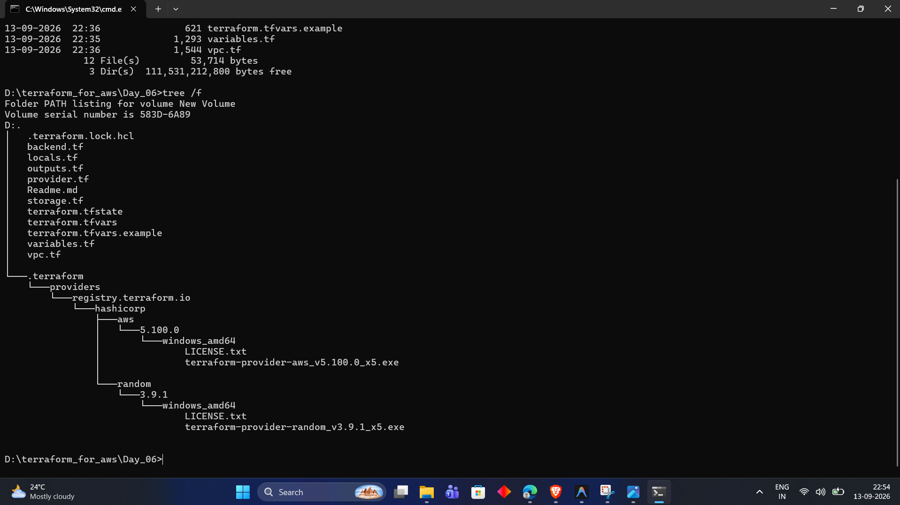

---

### 2. Code Formatting & Validation (`terraform fmt` & `terraform validate`)
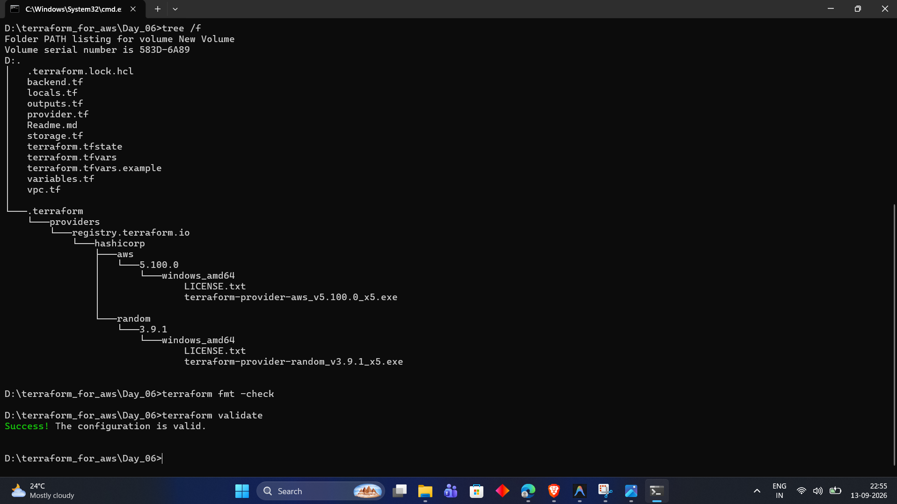

---

### 3. Execution Plan Initiation (`terraform plan`)
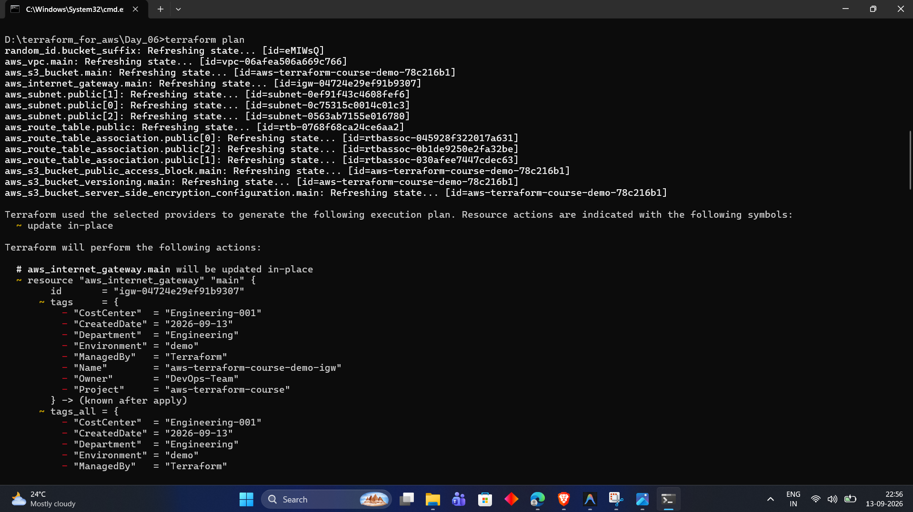

---

### 4. Plan Resource Changes — Internet Gateway & Route Table
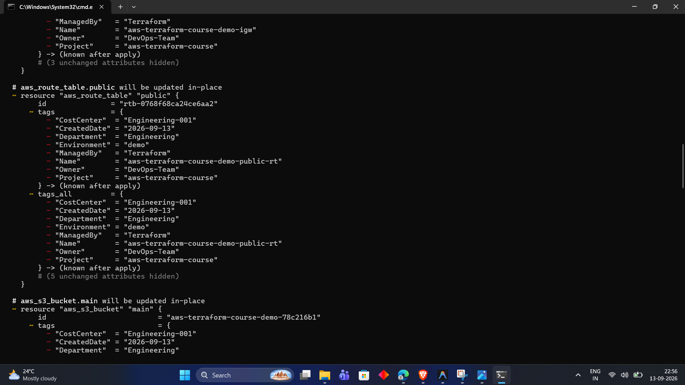

---

### 5. Plan Resource Changes — S3 Storage Bucket & Subnets
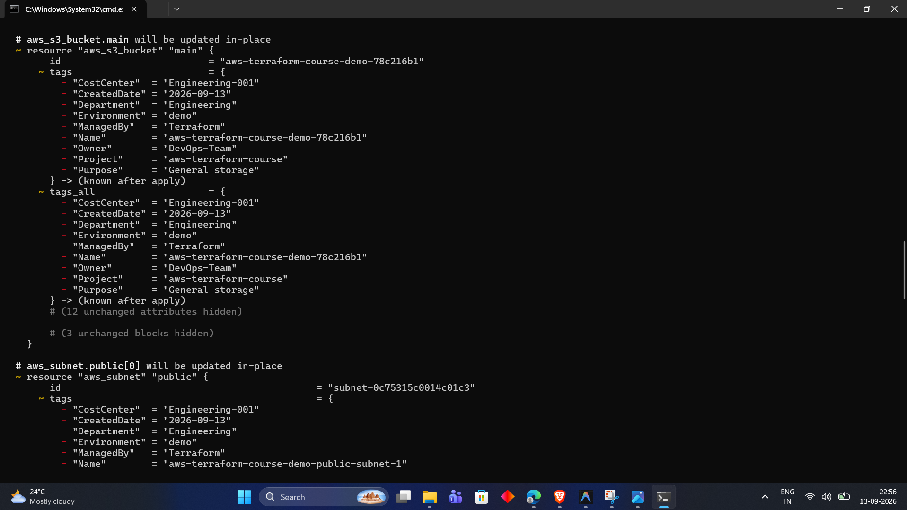

---

### 6. Plan Resource Changes — Multi-AZ Public Subnets (AZ-1 & AZ-2)
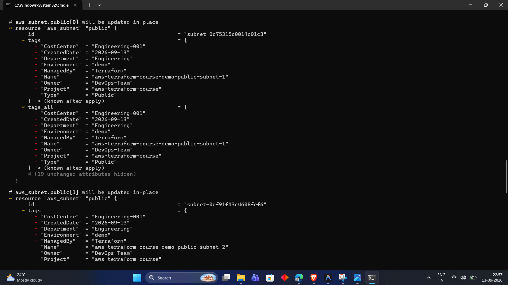

---

### 7. Plan Resource Changes — 3rd Public Subnet (AZ-3)
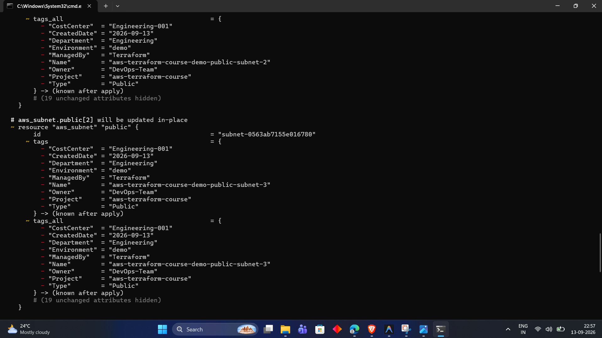

---

### 8. Plan Resource Changes — VPC & Planned Outputs Summary
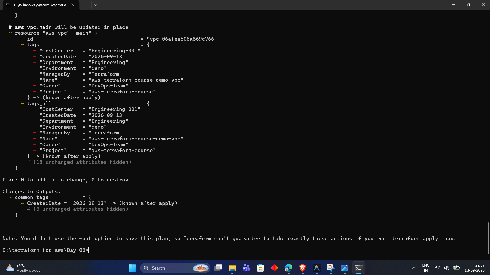

---

### 9. Terraform Apply Execution Initiation (`terraform apply -auto-approve`)
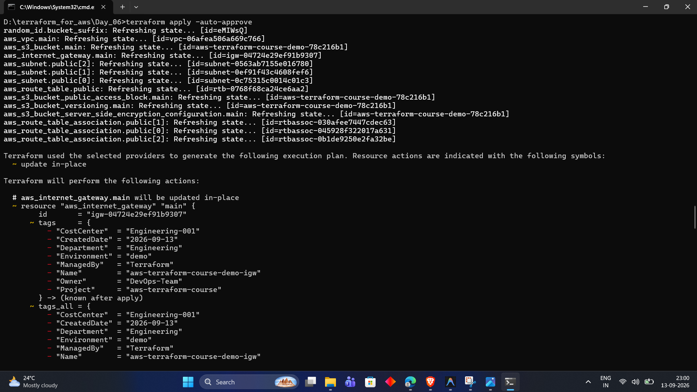

---

### 10. Terraform Apply Completion & Structured Output Values
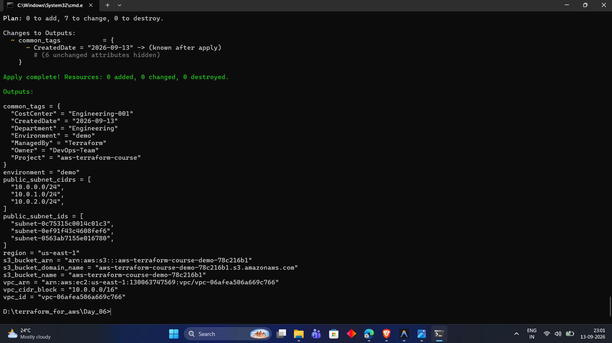

---

### 11. State Tracking & Output Inspection (`terraform state list` & `terraform output`)
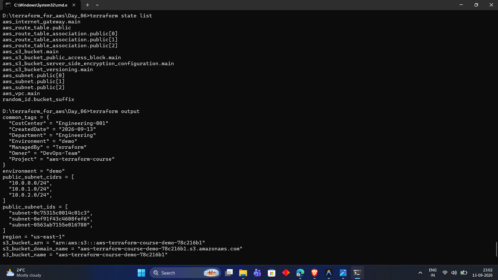

---

### 12. Complete Output Variables Query (`terraform output`)
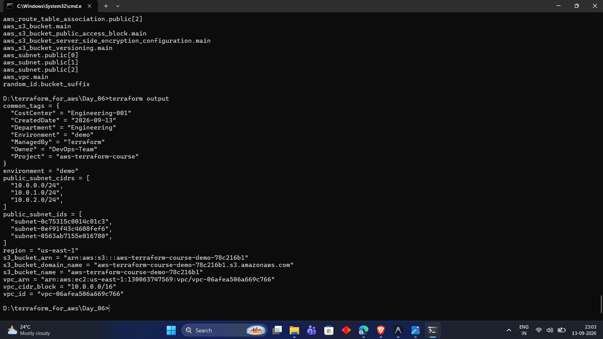

---

### 13. AWS Management Console — VPC Overview (`aws-terraform-course-demo-vpc`)
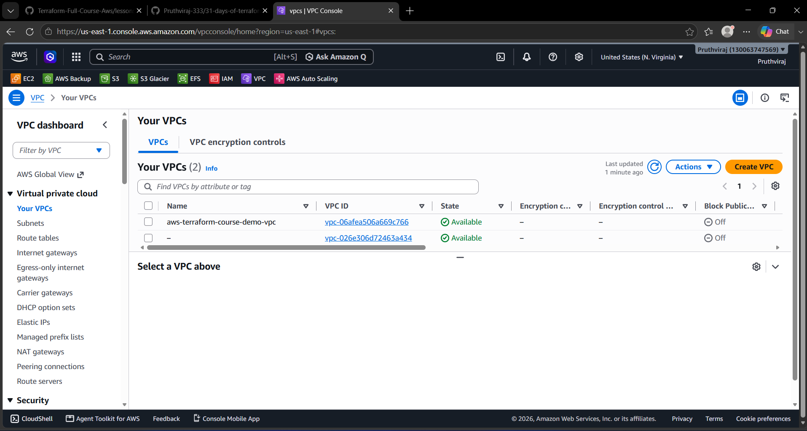

---

### 14. AWS Management Console — 3 Public Subnets Across Availability Zones
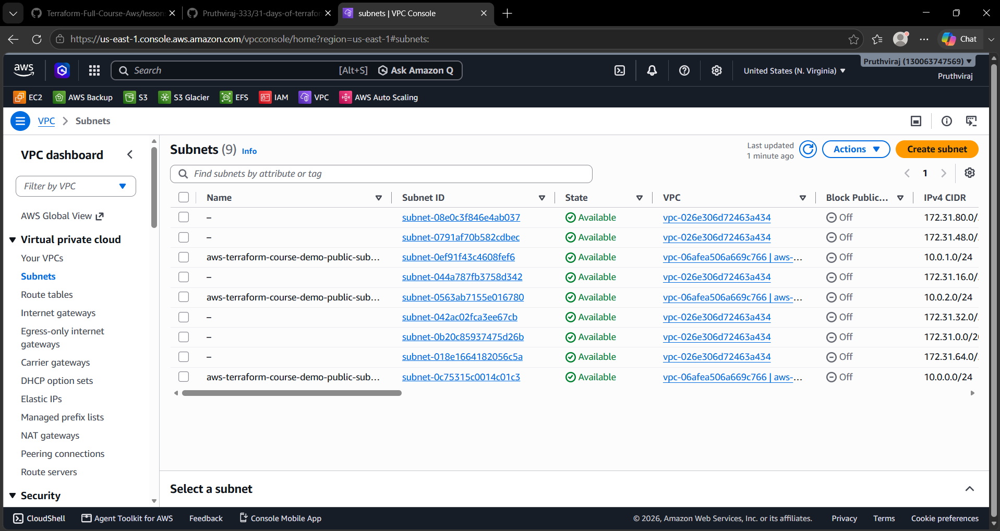

---

### 15. AWS Management Console — Public Route Table & Explicit Subnet Associations
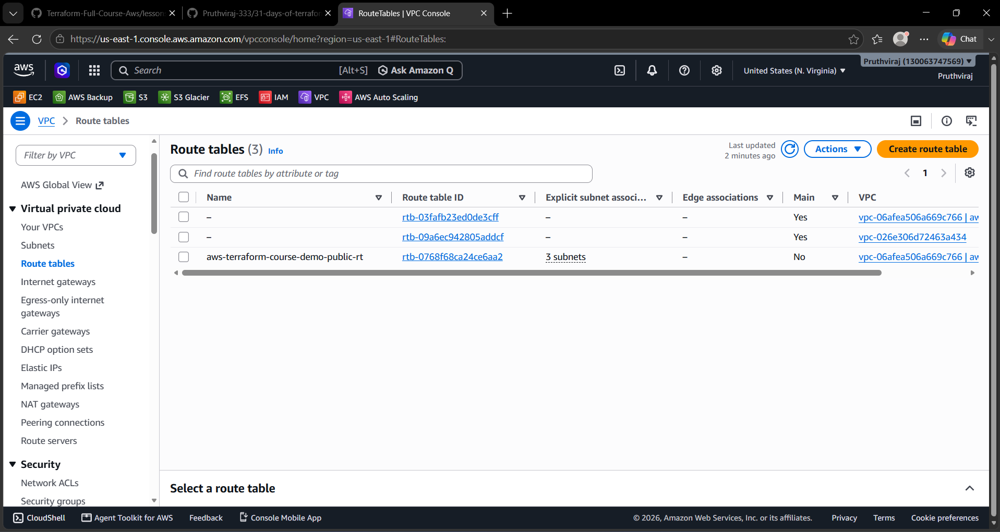

---

### 16. AWS Management Console — Amazon S3 Bucket Created
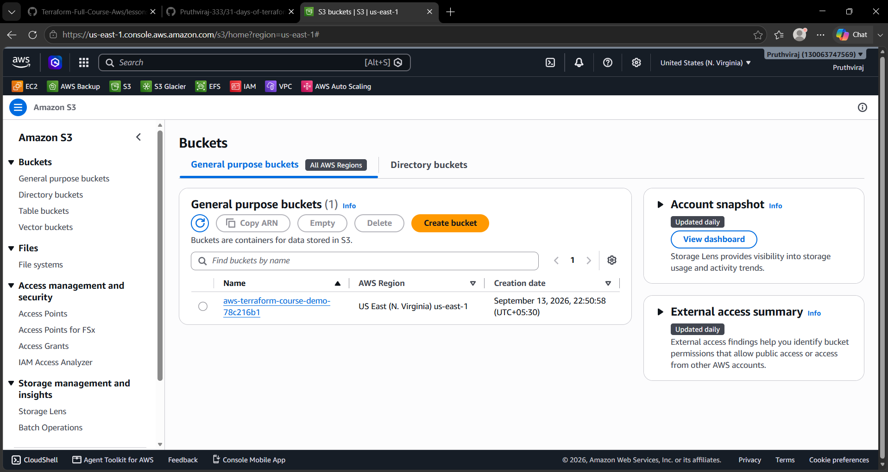

---

## Key Takeaways

1. **All `.tf` files in the directory are loaded as one unified namespace**; file names do not dictate execution order.
2. **Lexicographical file reading** does not impact resource dependencies; Terraform's Directed Acyclic Graph (DAG) handles ordering.
3. **Domain separation** (networking, storage, security, compute) enhances readability, maintainability, and collaboration.
4. **Standard file naming conventions** (`backend.tf`, `provider.tf`, `variables.tf`, `locals.tf`, `outputs.tf`) are standard across HashiCorp modules and community best practices.

---

## Next Steps

In **Day 07**, we will dive deeper into **Terraform Data Sources & Type Constraints**, learning how to query live AWS infrastructure dynamically.
