# Day 07 — Type Constraints in Terraform

> **31 Days of Terraform (AWS)** — A hands-on journey to master Terraform and Infrastructure as Code on AWS.

---

## Topics Covered

* [x] **Primitive Types** — `string`, `number`, `bool`
* [x] **Collection Types** — `list(type)`, `set(type)`, `map(type)`
* [x] **Structural Types** — `tuple([type1, type2, ...])`, `object({key1=type1, key2=type2, ...})`
* [x] **Custom Validation Rules** — `validation { condition, error_message }` blocks and regex matching
* [x] **Complex Type Definitions** — Multi-tier subnet definitions, structured server configurations, standardized tag maps
* [x] **Hands-on Practice** — Provisioning AWS VPC, multi-tier subnets from complex object lists, security groups from sets, and S3 buckets
* [x] **Common Type Patterns & Best Practices** — Type safety, error handling, and type conversion functions

---

## Architectural Overview

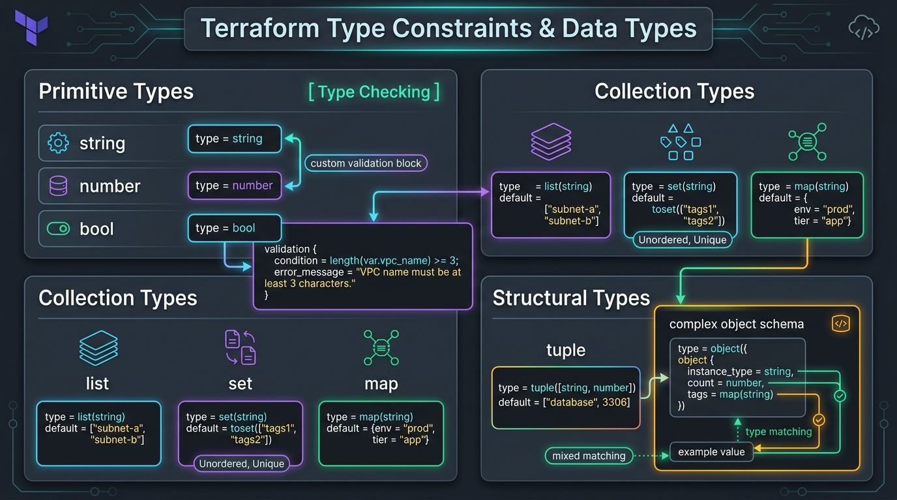

---

## 1. Understanding Terraform Type Constraints

Type constraints specify what data types are acceptable for an input variable. Specifying explicit types prevents runtime errors, catches invalid inputs early during `terraform plan`, and serves as self-documenting code for teams.

Terraform organizes types into three broad categories:

```text
┌─────────────────────────────────────────────────────────────────────────┐
│                        TERRAFORM TYPE CONSTRAINTS                       │
├───────────────────┬──────────────────────────┬──────────────────────────┤
│  PRIMITIVE TYPES  │     COLLECTION TYPES     │     STRUCTURAL TYPES     │
├───────────────────┼──────────────────────────┼──────────────────────────┤
│ • string          │ • list(<type>)           │ • tuple([<types>...])    │
│ • number          │ • set(<type>)            │ • object({<key>=<type>}) │
│ • bool            │ • map(<type>)            │                          │
└───────────────────┴──────────────────────────┴──────────────────────────┘
```

---

## 2. Primitive Types

Primitive types represent single, atomic values.

### 1. `string`
Represents a sequence of UTF-8 characters.
```hcl
variable "aws_region" {
  description = "Target AWS deployment region"
  type        = string
  default     = "us-east-1"
}
```

### 2. `number`
Represents both integers (e.g., `5`, `80`) and floating-point values (e.g., `3.14`).
```hcl
variable "instance_count" {
  description = "Number of EC2 instances to provision"
  type        = number
  default     = 2
}
```

### 3. `bool`
Represents boolean truth values (`true` or `false`).
```hcl
variable "enable_encryption" {
  description = "Enforce AES256 server-side encryption"
  type        = bool
  default     = true
}
```

---

## 3. Collection Types

Collection types group multiple values of the **same single type**.

| Collection Type | Ordered? | Duplicate Values Allowed? | Key / Index Format | Example |
| :--- | :---: | :---: | :--- | :--- |
| **`list(<type>)`** | Yes | Yes | Zero-based numeric index (`0, 1, 2...`) | `["us-east-1a", "us-east-1b"]` |
| **`set(<type>)`** | No | No (auto-deduplicated) | Value-based lookup | `[80, 443, 22]` |
| **`map(<type>)`** | No | Yes (unique keys) | String key-value lookup | `{ Env = "dev", Tier = "app" }` |

### 1. `list(type)`
```hcl
variable "availability_zones" {
  description = "Ordered list of availability zones"
  type        = list(string)
  default     = ["us-east-1a", "us-east-1b"]
}
```

### 2. `set(type)`
```hcl
variable "ingress_ports" {
  description = "Set of unique allowed ingress port numbers"
  type        = set(number)
  default     = [80, 443, 22]
}
```

### 3. `map(type)`
```hcl
variable "resource_tags" {
  description = "Key-value map of standardized tags"
  type        = map(string)
  default = {
    Owner     = "DevOps-Team"
    ManagedBy = "Terraform"
    Project   = "Type-Constraints-Demo"
  }
}
```

---

## 4. Structural Types

Structural types allow grouping values of **different types** according to a predefined schema.

### 1. `tuple([<type1>, <type2>, ...])`
An ordered sequence of a fixed length where each position has an exact specified type.
```hcl
variable "network_spec" {
  description = "Fixed tuple: [Subnet Name, CIDR Offset, Is Public]"
  type        = tuple([string, number, bool])
  default     = ["public-app", 1, true]
}
```

### 2. `object({ <attr> = <type>, ... })`
A complex structure with named attributes, where each attribute can have a distinct type constraint.
```hcl
variable "app_server_config" {
  description = "Complex structured server configuration object"
  type = object({
    instance_type         = string
    disk_size_gb          = number
    monitoring            = bool
    backup_retention_days = number
  })
  default = {
    instance_type         = "t3.micro"
    disk_size_gb          = 20
    monitoring            = true
    backup_retention_days = 7
  }
}
```

### 3. Complex Nested Collections: `list(object({...}))`
Used to manage multi-tier networking, multiple database nodes, or security rule groups:
```hcl
variable "subnet_definitions" {
  description = "List of structured objects defining multi-tier subnets"
  type = list(object({
    name      = string
    cidr      = string
    az        = string
    is_public = bool
  }))
  default = [
    {
      name      = "public-web-1"
      cidr      = "10.0.1.0/24"
      az        = "us-east-1a"
      is_public = true
    },
    {
      name      = "private-app-1"
      cidr      = "10.0.2.0/24"
      az        = "us-east-1b"
      is_public = false
    }
  ]
}
```

---

## 5. Custom Variable Validation Blocks

Terraform supports custom `validation` blocks within variable declarations to enforce business logic, naming rules, and security baselines before creating resources.

```hcl
variable "environment" {
  description = "Deployment environment name"
  type        = string
  default     = "dev"

  validation {
    condition     = contains(["dev", "staging", "production", "demo"], var.environment)
    error_message = "Environment must be one of: dev, staging, production, demo."
  }
}

variable "vpc_cidr" {
  description = "Base IPv4 CIDR block for the VPC"
  type        = string
  default     = "10.0.0.0/16"

  validation {
    condition     = can(cidrhost(var.vpc_cidr, 0))
    error_message = "VPC CIDR must be a valid IPv4 CIDR block (e.g. 10.0.0.0/16)."
  }
}
```

---

## 6. Complete Configuration Files

### 1. `provider.tf`
```hcl
terraform {
  required_version = ">= 1.5.0"

  required_providers {
    aws = {
      source  = "hashicorp/aws"
      version = "~> 5.0"
    }
    random = {
      source  = "hashicorp/random"
      version = "~> 3.5"
    }
  }
}

provider "aws" {
  region = var.aws_region
}
```

### 2. `variables.tf`
```hcl
# Primitive Types
variable "aws_region" {
  description = "Target AWS deployment region"
  type        = string
  default     = "us-east-1"

  validation {
    condition     = can(regex("^[a-z]{2}-[a-z]+-[0-9]{1}$", var.aws_region))
    error_message = "AWS region must follow valid format (e.g. us-east-1)."
  }
}

variable "environment" {
  description = "Deployment environment name"
  type        = string
  default     = "dev"

  validation {
    condition     = contains(["dev", "staging", "production", "demo"], var.environment)
    error_message = "Environment must be one of: dev, staging, production, demo."
  }
}

variable "vpc_cidr" {
  description = "Base IPv4 CIDR block for the VPC"
  type        = string
  default     = "10.0.0.0/16"

  validation {
    condition     = can(cidrhost(var.vpc_cidr, 0))
    error_message = "VPC CIDR must be a valid IPv4 CIDR block."
  }
}

variable "instance_count" {
  description = "Number of EC2 instances to provision"
  type        = number
  default     = 2

  validation {
    condition     = var.instance_count >= 1 && var.instance_count <= 10
    error_message = "Instance count must be an integer between 1 and 10."
  }
}

variable "enable_encryption" {
  description = "Flag to enforce server-side AES256 encryption on S3 and EBS"
  type        = bool
  default     = true
}

# Collection Types
variable "availability_zones" {
  description = "Ordered list of AWS availability zones"
  type        = list(string)
  default     = ["us-east-1a", "us-east-1b"]

  validation {
    condition     = length(var.availability_zones) >= 2
    error_message = "At least two availability zones must be specified."
  }
}

variable "ingress_ports" {
  description = "Unordered set of unique ingress port numbers"
  type        = set(number)
  default     = [80, 443, 22]
}

variable "resource_tags" {
  description = "Key-value map of standardized tags"
  type        = map(string)
  default = {
    Owner       = "DevOps-Team"
    ManagedBy   = "Terraform"
    Project     = "Type-Constraints-Demo"
    Day         = "Day_07"
  }
}

# Structural Types
variable "network_spec" {
  description = "Fixed-length, mixed-type tuple: [Prefix, CIDR Offset, Public IP]"
  type        = tuple([string, number, bool])
  default     = ["public-app", 1, true]
}

variable "app_server_config" {
  description = "Complex structured object defining application server specs"
  type = object({
    instance_type         = string
    disk_size_gb          = number
    monitoring            = bool
    backup_retention_days = number
  })
  default = {
    instance_type         = "t3.micro"
    disk_size_gb          = 20
    monitoring            = true
    backup_retention_days = 7
  }

  validation {
    condition     = contains(["t3.micro", "t3.small", "t3.medium", "t2.micro"], var.app_server_config.instance_type)
    error_message = "Instance type must be development class."
  }
}

variable "subnet_definitions" {
  description = "List of structured objects defining multi-tier subnets"
  type = list(object({
    name      = string
    cidr      = string
    az        = string
    is_public = bool
  }))
  default = [
    {
      name      = "public-web-1"
      cidr      = "10.0.1.0/24"
      az        = "us-east-1a"
      is_public = true
    },
    {
      name      = "private-app-1"
      cidr      = "10.0.2.0/24"
      az        = "us-east-1b"
      is_public = false
    }
  ]
}
```

### 3. `locals.tf`
```hcl
locals {
  common_tags = merge(
    var.resource_tags,
    {
      Environment = var.environment
      Region      = var.aws_region
    }
  )

  name_prefix = "${var.environment}-day07"

  sorted_ingress_ports = sort([for port in var.ingress_ports : tostring(port)])

  public_subnets = [
    for subnet in var.subnet_definitions : subnet if subnet.is_public
  ]

  private_subnets = [
    for subnet in var.subnet_definitions : subnet if !subnet.is_public
  ]
}
```

### 4. `main.tf`
```hcl
resource "random_string" "suffix" {
  length  = 6
  special = false
  upper   = false
}

resource "aws_vpc" "main" {
  cidr_block           = var.vpc_cidr
  enable_dns_hostnames = true
  enable_dns_support   = true

  tags = merge(
    local.common_tags,
    {
      Name = "${local.name_prefix}-vpc"
    }
  )
}

resource "aws_subnet" "tiers" {
  count = length(var.subnet_definitions)

  vpc_id                  = aws_vpc.main.id
  cidr_block              = var.subnet_definitions[count.index].cidr
  availability_zone       = var.subnet_definitions[count.index].az
  map_public_ip_on_launch = var.subnet_definitions[count.index].is_public

  tags = merge(
    local.common_tags,
    {
      Name = "${local.name_prefix}-${var.subnet_definitions[count.index].name}"
      Tier = var.subnet_definitions[count.index].is_public ? "Public" : "Private"
    }
  )
}

resource "aws_security_group" "web_sg" {
  name_prefix = "${local.name_prefix}-web-sg-"
  description = "Security group with dynamic ingress ports derived from typed set"
  vpc_id      = aws_vpc.main.id

  egress {
    from_port        = 0
    to_port          = 0
    protocol         = "-1"
    cidr_blocks      = ["0.0.0.0/0"]
    ipv6_cidr_blocks = ["::/0"]
  }

  tags = merge(
    local.common_tags,
    {
      Name = "${local.name_prefix}-web-sg"
    }
  )
}

resource "aws_vpc_security_group_ingress_rule" "ingress_rules" {
  for_each = toset([for port in var.ingress_ports : tostring(port)])

  security_group_id = aws_security_group.web_sg.id
  cidr_ipv4         = "0.0.0.0/0"
  from_port         = tonumber(each.value)
  to_port           = tonumber(each.value)
  ip_protocol       = "tcp"
  description       = "Allow inbound traffic on port ${each.value}"
}

resource "aws_s3_bucket" "app_storage" {
  bucket        = "${local.name_prefix}-storage-${random_string.suffix.result}"
  force_destroy = true

  tags = merge(
    local.common_tags,
    {
      Name        = "${local.name_prefix}-storage"
      InstanceRef = var.app_server_config.instance_type
    }
  )
}

resource "aws_s3_bucket_server_side_encryption_configuration" "app_storage_enc" {
  count  = var.enable_encryption ? 1 : 0
  bucket = aws_s3_bucket.app_storage.id

  rule {
    apply_server_side_encryption_by_default {
      sse_algorithm = "AES256"
    }
  }
}

resource "aws_s3_bucket_public_access_block" "app_storage_pab" {
  bucket = aws_s3_bucket.app_storage.id

  block_public_acls       = true
  block_public_policy     = true
  ignore_public_acls      = true
  restrict_public_buckets = true
}
```

### 5. `outputs.tf`
```hcl
output "vpc_id" {
  description = "ID of the provisioned VPC (string)"
  value       = aws_vpc.main.id
}

output "vpc_cidr_block" {
  description = "CIDR block of the VPC (string)"
  value       = aws_vpc.main.cidr_block
}

output "subnet_ids" {
  description = "List of created subnet IDs (list of strings)"
  value       = aws_subnet.tiers[*].id
}

output "subnet_mapping" {
  description = "Map of subnet name to subnet ID (map of strings)"
  value = {
    for idx, subnet in aws_subnet.tiers :
    var.subnet_definitions[idx].name => subnet.id
  }
}

output "security_group_id" {
  description = "ID of the created Security Group (string)"
  value       = aws_security_group.web_sg.id
}

output "allowed_ingress_ports" {
  description = "Configured allowed ingress ports (set of numbers)"
  value       = var.ingress_ports
}

output "app_server_spec" {
  description = "Application server specifications (structured object)"
  value       = var.app_server_config
}

output "s3_bucket_name" {
  description = "Name of the created S3 storage bucket (string)"
  value       = aws_s3_bucket.app_storage.bucket
}

output "s3_bucket_arn" {
  description = "ARN of the S3 storage bucket (string)"
  value       = aws_s3_bucket.app_storage.arn
}

output "common_tags" {
  description = "Merged resource tags (map of strings)"
  value       = local.common_tags
}
```

---

## 7. Diagrams

### Type System Classification & Flow

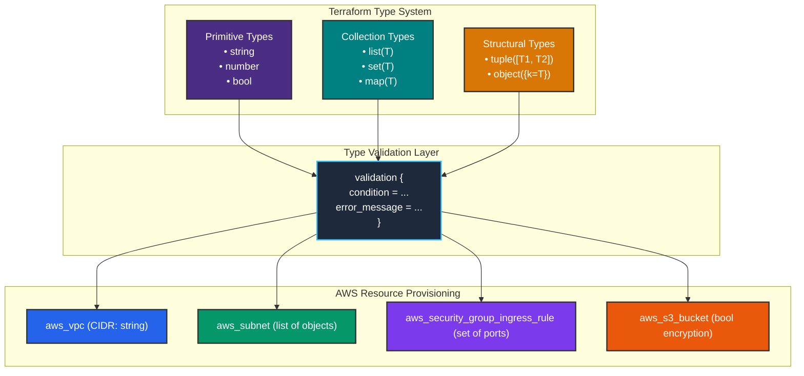
```mermaid
flowchart TD
    subgraph Types ["Terraform Type System"]
        Prim["Primitive Types<br>• string<br>• number<br>• bool"]
        Coll["Collection Types<br>• list(T)<br>• set(T)<br>• map(T)"]
        Struct["Structural Types<br>• tuple([T1, T2])<br>• object({k=T})"]
    end

    subgraph Val ["Type Validation Layer"]
        ValBlock["validation {<br>  condition = ...<br>  error_message = ...<br>}"]
    end

    subgraph AWS ["AWS Resource Provisioning"]
        VPC["aws_vpc (CIDR: string)"]
        Subnets["aws_subnet (list of objects)"]
        SG["aws_security_group_ingress_rule (set of ports)"]
        S3["aws_s3_bucket (bool encryption)"]
    end

    Prim --> ValBlock
    Coll --> ValBlock
    Struct --> ValBlock

    ValBlock --> VPC
    ValBlock --> Subnets
    ValBlock --> SG
    ValBlock --> S3

    style Prim fill:#4B2E83,stroke:#333,stroke-width:2px,color:#fff
    style Coll fill:#008080,stroke:#333,stroke-width:2px,color:#fff
    style Struct fill:#D97706,stroke:#333,stroke-width:2px,color:#fff
    style ValBlock fill:#1E293B,stroke:#38BDF8,stroke-width:2px,color:#fff
    style VPC fill:#2563EB,stroke:#333,stroke-width:2px,color:#fff
    style Subnets fill:#059669,stroke:#333,stroke-width:2px,color:#fff
    style SG fill:#7C3AED,stroke:#333,stroke-width:2px,color:#fff
    style S3 fill:#EA580C,stroke:#333,stroke-width:2px,color:#fff
```

---

## 8. Verification & Screenshots

The following screenshots capture the end-to-end execution, validation testing, deployment lifecycle, and AWS console verification for Day 07.

### 1. Terraform Code Validation

```bash
terraform validate
```

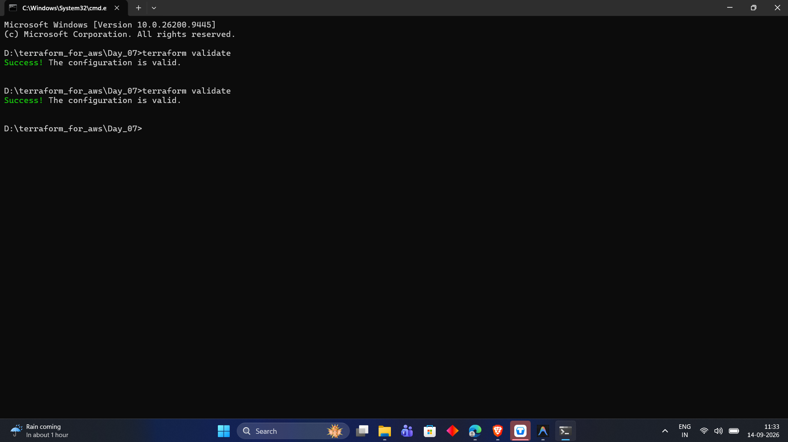

---

### 2. Custom Variable Validation Rule Testing

Testing validation blocks by passing deliberately invalid values:

#### VPC CIDR Validation Failure (`can(cidrhost(...))`)

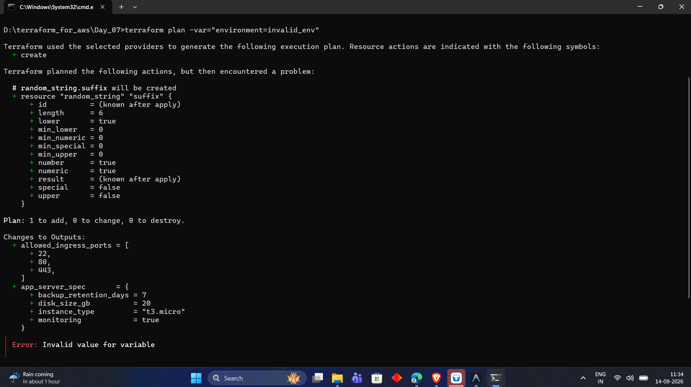

#### Server Specification Disk Size & Instance Type Validation Failure

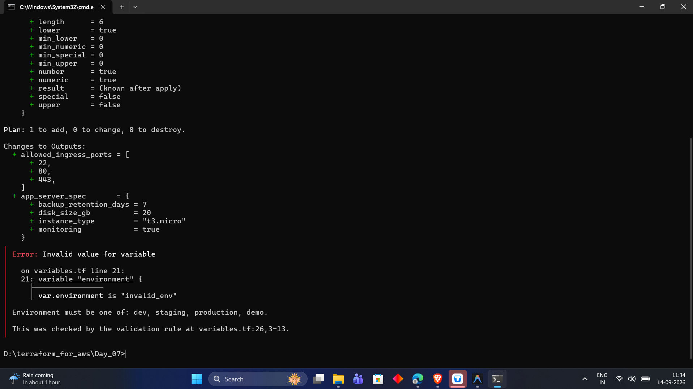

---

### 3. Execution Plan Inspection (`terraform plan`)

Reviewing planned resource attributes across primitive, collection, and structural types:

#### S3 Storage Bucket & Random Suffix Resource Plan

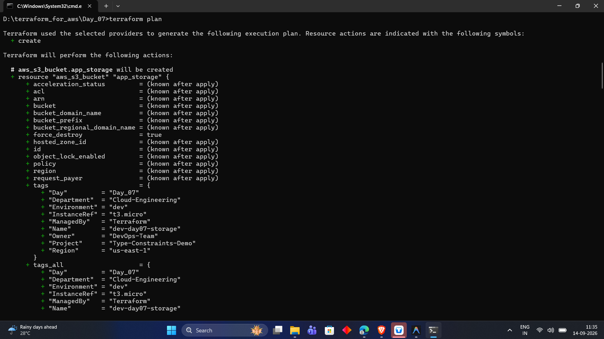

#### S3 Server-Side Encryption & Public Access Block Plan

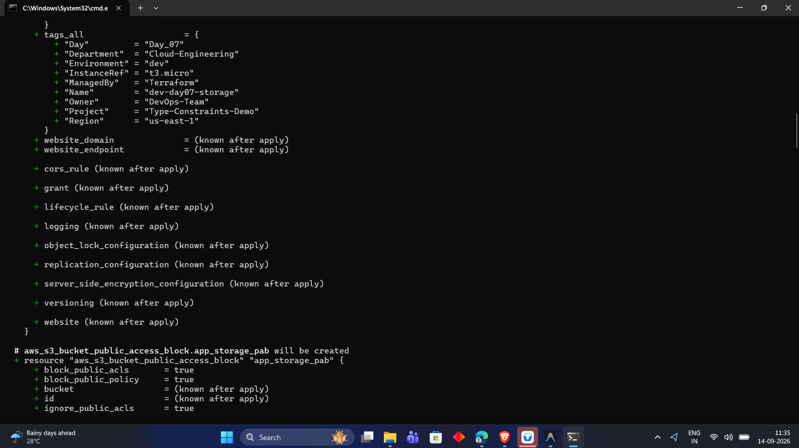

#### Security Group & Dynamic Ingress Rules Plan

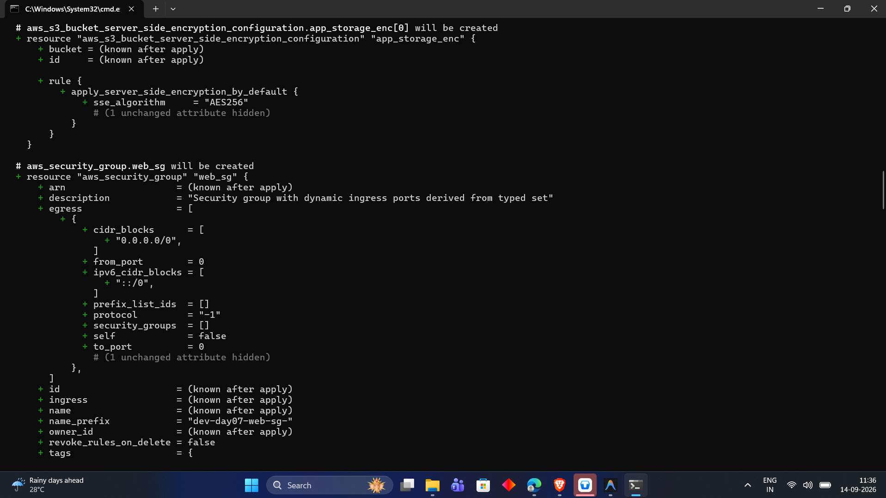

#### Public Subnet (Index 0 from Complex Object List)

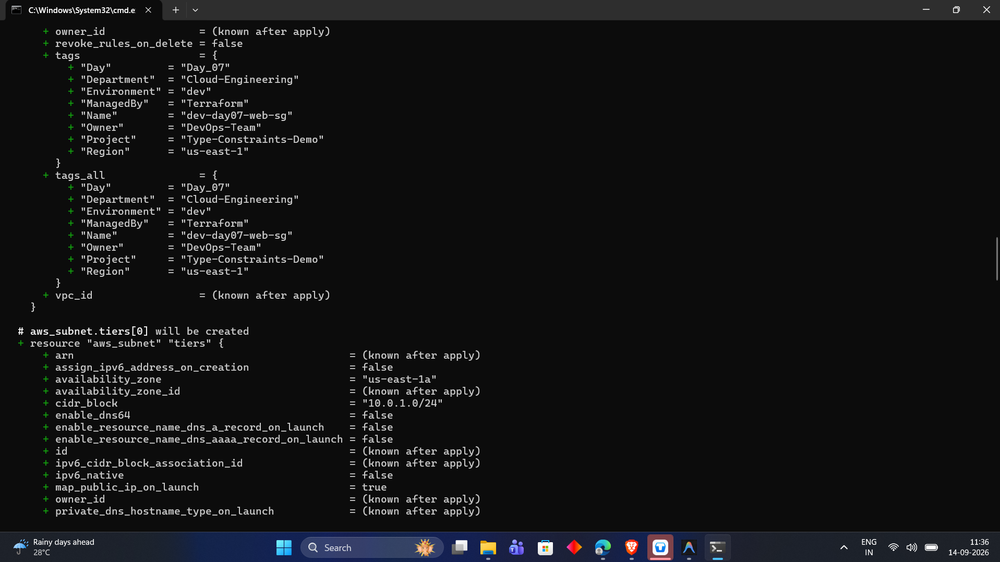

#### Private Subnet (Index 1 from Complex Object List)

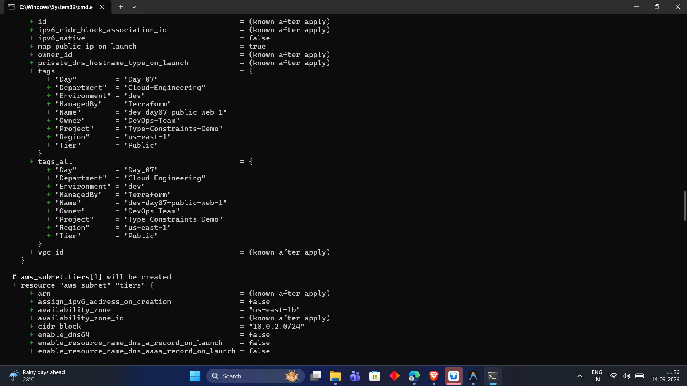

#### VPC Configuration & Resource Summary (Plan: 11 to add)

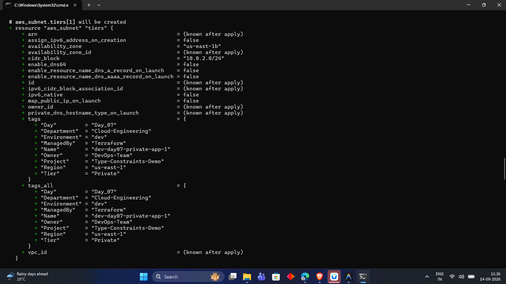

#### Outputs Preview & Apply Confirmation Prompt

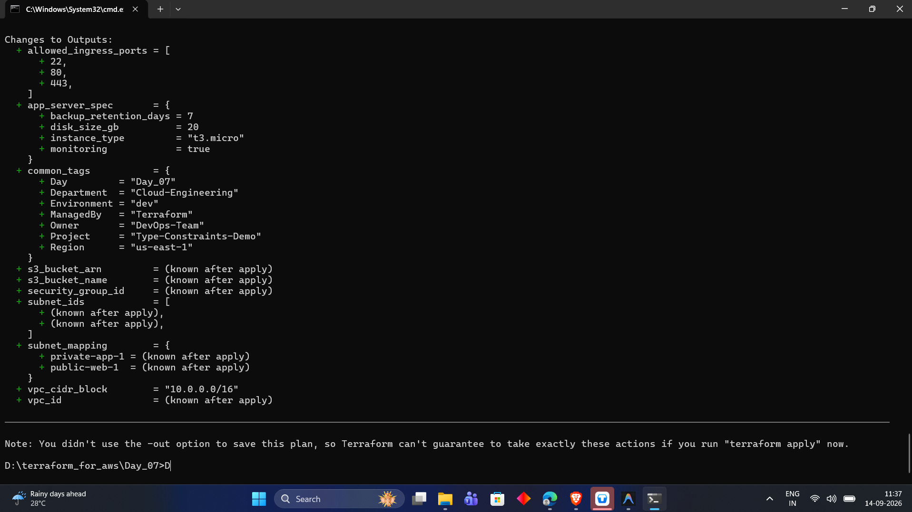

---

### 4. Terraform Apply Execution (`terraform apply`)

Executing the deployment plan to provision all typed resources in AWS:

#### Resource Provisioning in Progress

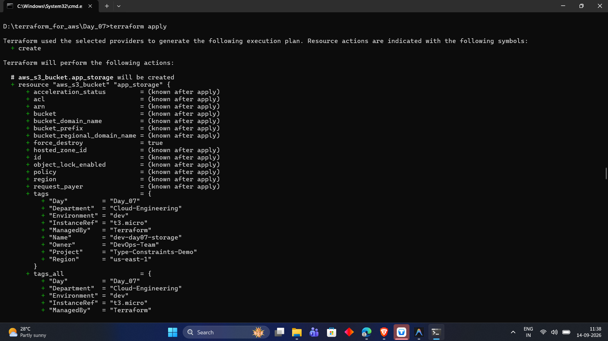

#### Apply Completion Summary (11 Added)

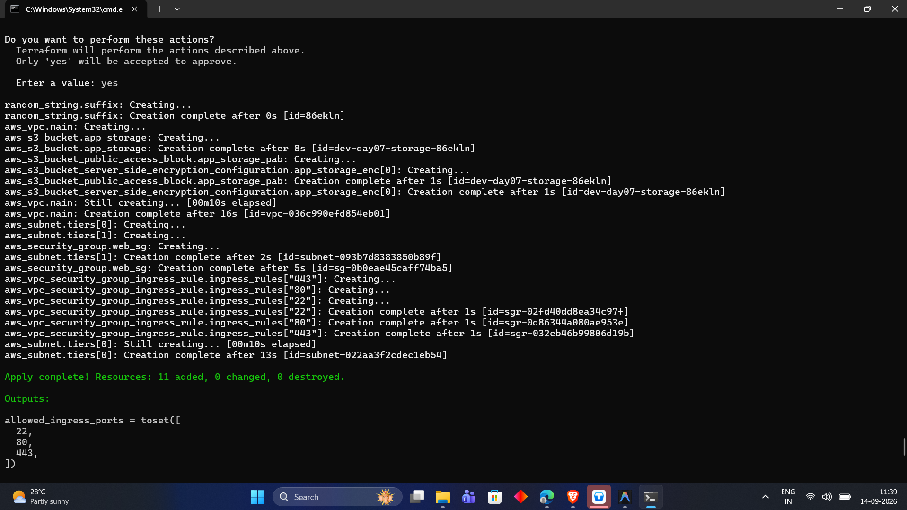

#### Typed Outputs Displayed Upon Apply Completion

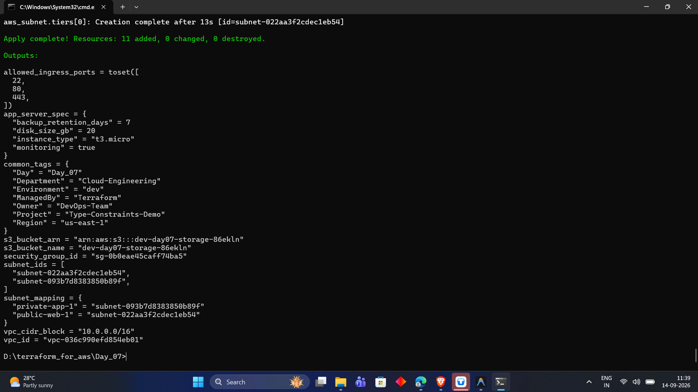

---

### 5. Inspecting Outputs (`terraform output`)

Querying the structured outputs after deployment:

```bash
terraform output
```

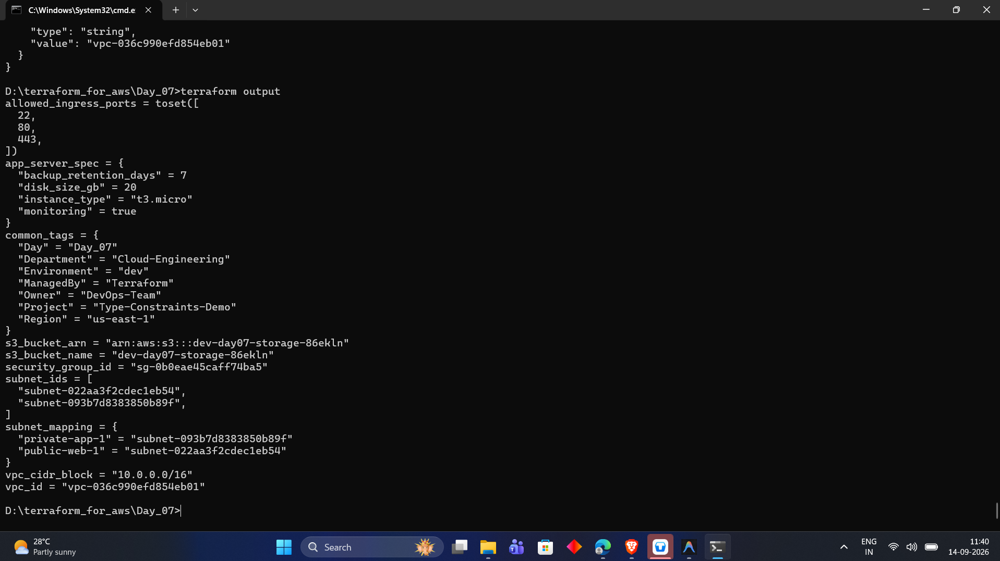

---

### 6. AWS Management Console Verification

Validating the deployed resources in the AWS Management Console (`us-east-1`):

#### VPC Subnets View (`dev-day07-public-web-1` and `dev-day07-private-app-1`)

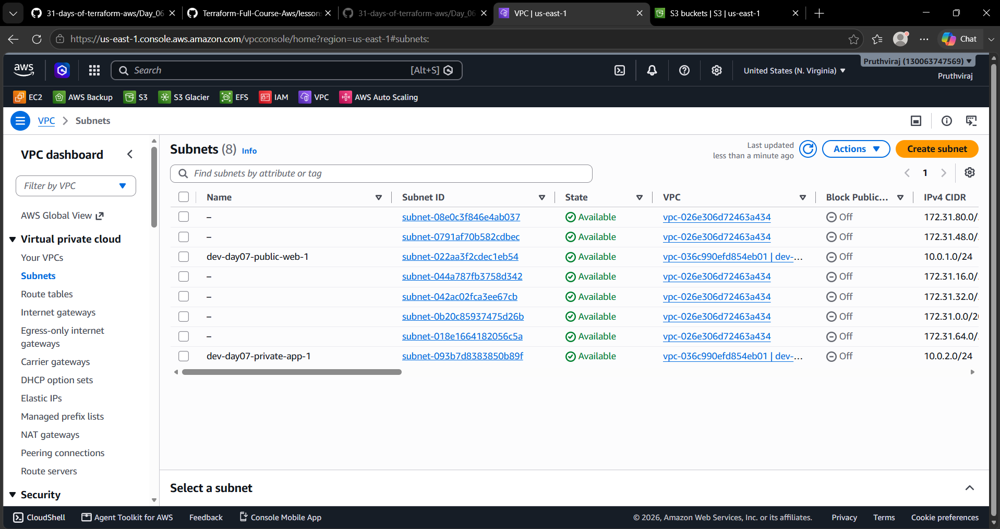

#### Security Groups View (`dev-day07-web-sg`)

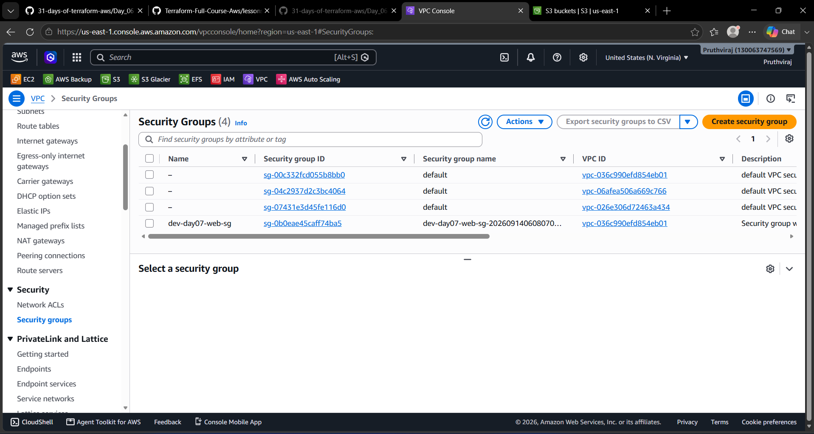

#### S3 Storage Bucket View (`dev-day07-storage-*`)

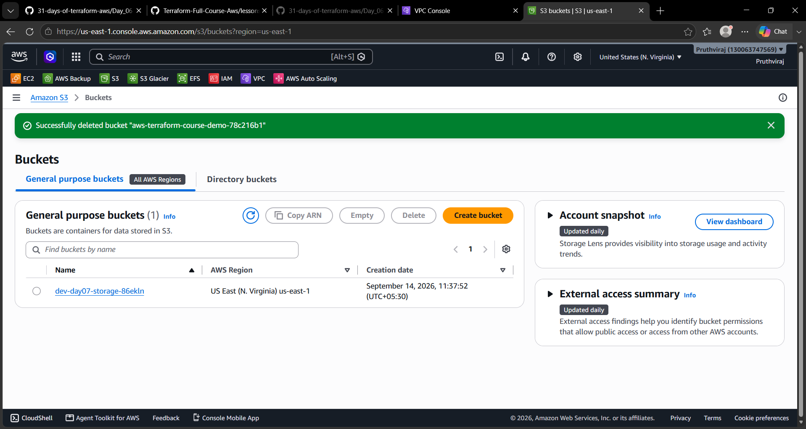

---

## Key Takeaways

1. **Explicit Types:** Always specify the `type` parameter for every input variable. Avoid generic unconstrained variables (`any`) unless building abstract helper modules.
2. **Lists vs. Sets:** Use `list` when order and indexing matter (e.g., subnets across AZs); use `set` when items must be unique and unordered (e.g., firewall port numbers).
3. **Maps vs. Objects:** Use `map` when all values share the exact same type (e.g., `map(string)` for tags); use `object` when attributes have mixed types (e.g., `instance_type = string`, `disk_size_gb = number`).
4. **Validation Rules:** Use `validation` blocks with `contains()`, `can()`, `regex()`, and comparison operators to fail fast before resource creation.
5. **Self-Documenting Schemas:** Structural `object` definitions enforce clean APIs for reusable modules across teams.

---

## Next Steps

In **Day 08**, we will explore **Terraform Meta-Arguments & Dynamic Loops**, diving into `count`, `for_each`, `for` expressions, and `dynamic` blocks for flexible infrastructure provisioning.

