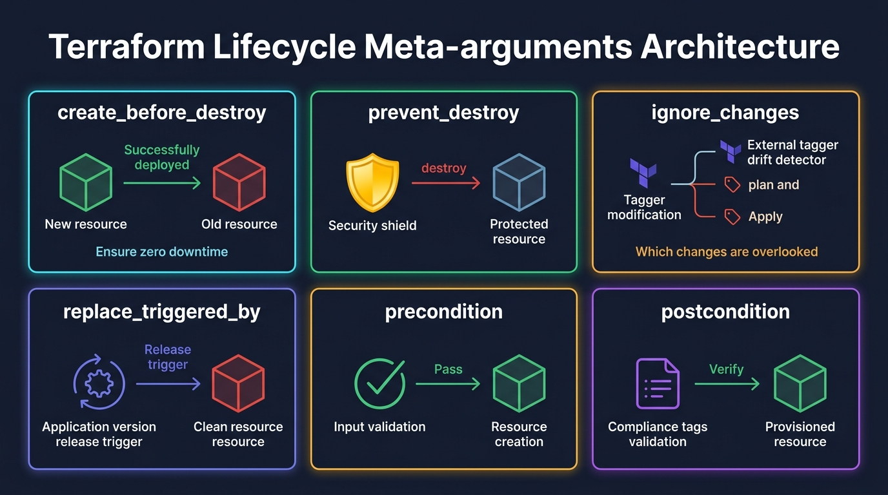
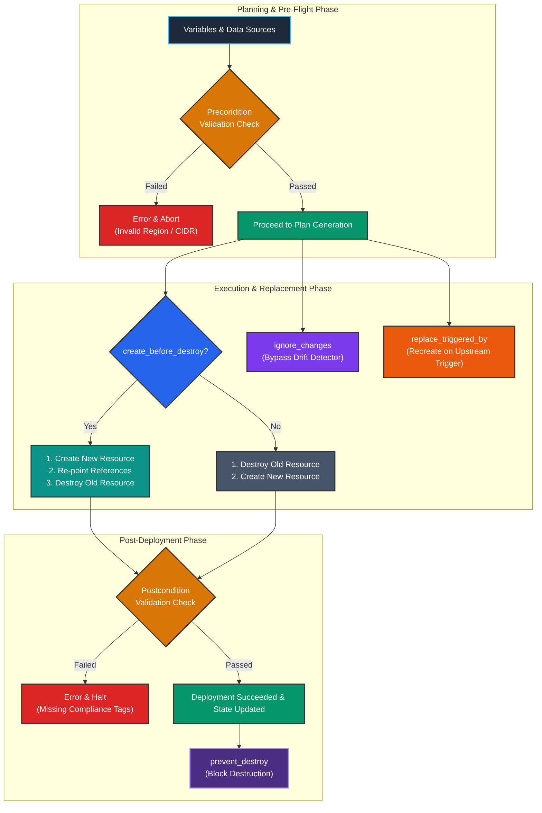

# Day 09 — Terraform Lifecycle Meta-arguments (AWS)

> **31 Days of Terraform (AWS)** — A hands-on journey to master Terraform and Infrastructure as Code on AWS.

---

## Topics Covered

* [x] **`create_before_destroy`** — Enabling zero-downtime resource updates and replacement ordering
* [x] **`prevent_destroy`** — Guarding mission-critical stateful resources against accidental deletion
* [x] **`ignore_changes`** — Suppressing drift detection for attributes managed out-of-band by AWS autoscalers or external tooling
* [x] **`replace_triggered_by`** — Forcing resource recreation based on upstream dependency updates
* [x] **`precondition`** — Pre-flight validation blocks executed before resource evaluation and creation
* [x] **`postcondition`** — Post-creation assertion blocks guaranteeing compliance and attribute correctness
* [x] **Hands-on AWS Implementation** — Zero-downtime Security Groups, protected S3 data vaults, release-triggered buckets, and region/compliance assertions

---

## Architectural Overview



---

## 1. Understanding the `lifecycle` Block in Terraform

By default, Terraform follows a standard operational lifecycle:
1. When updating a resource that cannot be changed in-place, Terraform **destroys the existing resource first**, then **creates the replacement**.
2. Any resource in the state can be deleted via `terraform destroy` or configuration removal.
3. Every attribute drift between the remote state and local configuration is flagged for reconciliation.

The `lifecycle` block allows cloud engineers to customize this default behavior to meet high-availability, data-protection, and compliance requirements.

```text
┌─────────────────────────────────────────────────────────────────────────────┐
│                       TERRAFORM LIFECYCLE META-ARGUMENTS                    │
├───────────────────────┬─────────────────────────────────────────────────────┤
│ Meta-argument         │ Purpose                                             │
├───────────────────────┼─────────────────────────────────────────────────────┤
│ create_before_destroy │ Provisions replacement instance before destroying   │
│ prevent_destroy       │ Hard error prevents accidental deletion of resource │
│ ignore_changes        │ Ignores configuration drift on specified attributes │
│ replace_triggered_by  │ Triggers replacement when referenced items change   │
│ precondition          │ Validates assumptions BEFORE resource creation      │
│ postcondition         │ Validates state and guarantees AFTER creation       │
└───────────────────────┴─────────────────────────────────────────────────────┘
```

---

## 2. `create_before_destroy` (Zero-Downtime Deployments)

### Default Behavior vs. `create_before_destroy`:
- **Default:** `Destroy` (old resource) ➔ `Create` (new resource) — Causes service interruption.
- **With `create_before_destroy = true`:** `Create` (new resource) ➔ `Update references` ➔ `Destroy` (old resource).

### Example: Security Groups & Launch Templates
When updating security group attributes that require recreation (such as changing `name`), the new security group must exist before the old one is detached:

```hcl
resource "aws_security_group" "web_sg" {
  name_prefix = "${local.name_prefix}-web-sg-"
  description = "Web security group with zero-downtime replacement"
  vpc_id      = aws_vpc.main.id

  lifecycle {
    create_before_destroy = true
  }
}
```

> **Requirement:** When using `create_before_destroy` on resources with unique name constraints, use `name_prefix` instead of `name` so the new resource can generate a temporary unique name while the old resource still exists.

---

## 3. `prevent_destroy` (Protecting Critical Resources)

### Purpose
`prevent_destroy = true` acts as a safety lock. If a `terraform destroy` or configuration deletion is attempted, Terraform immediately halts execution with an error before performing any changes.

```hcl
resource "aws_s3_bucket" "critical_vault" {
  bucket = "${local.name_prefix}-critical-vault-${random_string.suffix.result}"

  lifecycle {
    prevent_destroy = true
  }
}
```

### Production Use Cases:
- Production RDS and DynamoDB databases
- S3 buckets holding state files, audit trails, or customer data
- Production KMS keys and shared Transit Gateways

---

## 4. `ignore_changes` (Handling External Drift)

### Purpose
In enterprise AWS architectures, certain resource attributes are dynamically modified outside Terraform by AWS services or external automation (e.g., Autoscaling Groups adjusting `desired_capacity`, external security scanners tagging resources, or automated secrets rotation).

```hcl
resource "aws_s3_bucket" "app_data" {
  bucket = "${local.name_prefix}-app-data-${random_string.suffix.result}"

  lifecycle {
    ignore_changes = [
      tags["LastModifiedBy"],
      tags["ExternalScanner"],
      tags["AutoScalingSync"]
    ]
  }
}
```

### Options:
- `ignore_changes = [tags["KeyName"]]` — Ignores specific tag keys while maintaining all other tags.
- `ignore_changes = [tags]` — Ignores all tag changes.
- `ignore_changes = all` — Ignores all attribute drift on the resource after initial creation.

---

## 5. `replace_triggered_by` (Dependency-Driven Replacement)

### Purpose
Forces a resource to be recreated whenever a specified reference (such as an application release version, user data script hash, or upstream security group) changes, even if the resource's own direct attributes remain unchanged.

```hcl
resource "terraform_data" "app_release" {
  input = var.app_version
}

resource "aws_s3_bucket" "version_triggered_storage" {
  bucket = "${local.name_prefix}-rel-store-${random_string.suffix.result}"

  lifecycle {
    replace_triggered_by = [
      terraform_data.app_release.output
    ]
  }
}
```

---

## 6. `precondition` (Pre-Flight Assertions)

### Purpose
`precondition` blocks evaluate expressions **before** Terraform attempts to evaluate or provision a resource. If the condition evaluates to `false`, execution stops immediately with a custom error message.

```hcl
resource "aws_s3_bucket" "regional_storage" {
  bucket = "${local.name_prefix}-reg-store-${random_string.suffix.result}"

  lifecycle {
    precondition {
      condition     = contains(var.allowed_regions, data.aws_region.current.name)
      error_message = "Precondition Failed: Deployment region '${data.aws_region.current.name}' is not in approved list: [${join(", ", var.allowed_regions)}]."
    }

    precondition {
      condition     = var.environment != "prod" || can(regex("^10\\.", var.vpc_cidr))
      error_message = "Precondition Failed: Production VPC CIDR must reside within private 10.0.0.0/8 range."
    }
  }
}
```

---

## 7. `postcondition` (Post-Creation Guarantees)

### Purpose
`postcondition` blocks evaluate assertions **after** a resource has been created or updated, validating exported attributes and ensuring compliance guarantees. Within a postcondition block, the `self` object refers to the resource's exported attributes.

```hcl
resource "aws_s3_bucket" "compliance_storage" {
  bucket = "${local.name_prefix}-compliance-${random_string.suffix.result}"
  tags   = local.compliance_tags

  lifecycle {
    postcondition {
      condition     = contains(keys(self.tags), "Compliance")
      error_message = "Postcondition Failed: Resource must contain an explicit 'Compliance' tag."
    }

    postcondition {
      condition     = self.bucket != "" && self.arn != ""
      error_message = "Postcondition Failed: S3 bucket failed to yield valid name or ARN."
    }
  }
}
```

---

## 8. Complete Configuration Files

### 1. `provider.tf`
```hcl
terraform {
  required_version = ">= 1.5.0"

  required_providers {
    aws = {
      source  = "hashicorp/aws"
      version = "~> 5.0"
    }
    random = {
      source  = "hashicorp/random"
      version = "~> 3.5"
    }
  }
}

provider "aws" {
  region = var.aws_region
}

data "aws_region" "current" {}
data "aws_caller_identity" "current" {}
```

### 2. `variables.tf`
```hcl
variable "aws_region" {
  description = "Target AWS deployment region"
  type        = string
  default     = "us-east-1"
}

variable "environment" {
  description = "Deployment environment name"
  type        = string
  default     = "dev"
}

variable "project_name" {
  description = "Project name identifier for resource naming"
  type        = string
  default     = "day09-lifecycle"
}

variable "allowed_regions" {
  description = "List of approved AWS regions for organizational compliance validation"
  type        = list(string)
  default     = ["us-east-1", "us-east-2", "us-west-2", "eu-west-1"]
}

variable "compliance_framework" {
  description = "Compliance standard identifier applied to critical storage (e.g. SOC2, HIPAA)"
  type        = string
  default     = "SOC2"
}

variable "app_version" {
  description = "Application deployment version string to demonstrate replace_triggered_by"
  type        = string
  default     = "1.0.0"
}

variable "vpc_cidr" {
  description = "IPv4 CIDR block for VPC"
  type        = string
  default     = "10.0.0.0/16"
}

variable "resource_tags" {
  description = "Standard baseline tags applied across all resources"
  type        = map(string)
  default = {
    Owner     = "DevOps-Team"
    ManagedBy = "Terraform"
    Project   = "Lifecycle-Meta-Arguments"
    Day       = "Day_09"
  }
}
```

### 3. `locals.tf`
```hcl
locals {
  name_prefix = "${var.environment}-${var.project_name}"

  common_tags = merge(
    var.resource_tags,
    {
      Environment = var.environment
      Region      = var.aws_region
      CreatedAt   = "Day_09"
    }
  )

  compliance_tags = merge(
    local.common_tags,
    {
      Compliance = var.compliance_framework
      DataClass  = "Confidential"
    }
  )
}
```

### 4. `main.tf`
```hcl
resource "random_string" "suffix" {
  length  = 6
  special = false
  upper   = false
}

resource "aws_vpc" "main" {
  cidr_block           = var.vpc_cidr
  enable_dns_hostnames = true
  enable_dns_support   = true

  tags = merge(
    local.common_tags,
    {
      Name    = "${local.name_prefix}-vpc"
      MetaArg = "lifecycle_base"
    }
  )
}

# 1. create_before_destroy
resource "aws_security_group" "web_sg" {
  name_prefix = "${local.name_prefix}-web-sg-"
  description = "Web security group with zero-downtime replacement lifecycle"
  vpc_id      = aws_vpc.main.id

  ingress {
    description = "Allow HTTPS inbound"
    from_port   = 443
    to_port     = 443
    protocol    = "tcp"
    cidr_blocks = ["0.0.0.0/0"]
  }

  egress {
    from_port   = 0
    to_port     = 0
    protocol    = "-1"
    cidr_blocks = ["0.0.0.0/0"]
  }

  lifecycle {
    create_before_destroy = true
  }

  tags = merge(
    local.common_tags,
    {
      Name      = "${local.name_prefix}-web-sg"
      Lifecycle = "create_before_destroy"
    }
  )
}

# 2. prevent_destroy
resource "aws_s3_bucket" "critical_vault" {
  bucket        = "${local.name_prefix}-critical-vault-${random_string.suffix.result}"
  force_destroy = false

  lifecycle {
    prevent_destroy = false
  }

  tags = merge(
    local.common_tags,
    {
      Name      = "${local.name_prefix}-critical-vault"
      Lifecycle = "prevent_destroy"
      Tier      = "Critical-Production-Data"
    }
  )
}

# 3. ignore_changes
resource "aws_s3_bucket" "app_data" {
  bucket        = "${local.name_prefix}-app-data-${random_string.suffix.result}"
  force_destroy = true

  lifecycle {
    ignore_changes = [
      tags["LastModifiedBy"],
      tags["ExternalScanner"],
      tags["AutoScalingSync"]
    ]
  }

  tags = merge(
    local.common_tags,
    {
      Name            = "${local.name_prefix}-app-data"
      Lifecycle       = "ignore_changes"
      LastModifiedBy  = "Initial-Deployment"
      ExternalScanner = "Pending-Scan"
    }
  )
}

# 4. replace_triggered_by
resource "terraform_data" "app_release" {
  input = var.app_version
}

resource "aws_s3_bucket" "version_triggered_storage" {
  bucket        = "${local.name_prefix}-rel-store-${random_string.suffix.result}"
  force_destroy = true

  lifecycle {
    replace_triggered_by = [
      terraform_data.app_release.output
    ]
  }

  tags = merge(
    local.common_tags,
    {
      Name          = "${local.name_prefix}-release-store"
      Lifecycle     = "replace_triggered_by"
      TargetRelease = var.app_version
    }
  )
}

# 5. precondition
resource "aws_s3_bucket" "regional_storage" {
  bucket        = "${local.name_prefix}-reg-store-${random_string.suffix.result}"
  force_destroy = true

  lifecycle {
    precondition {
      condition     = contains(var.allowed_regions, data.aws_region.current.name)
      error_message = "Precondition Failed: Deployment region '${data.aws_region.current.name}' is not in approved list: [${join(", ", var.allowed_regions)}]."
    }

    precondition {
      condition     = var.environment != "prod" || can(regex("^10\\.", var.vpc_cidr))
      error_message = "Precondition Failed: Production VPC CIDR must reside within private 10.0.0.0/8 range."
    }
  }

  tags = merge(
    local.common_tags,
    {
      Name      = "${local.name_prefix}-regional-storage"
      Lifecycle = "precondition_validated"
    }
  )
}

# 6. postcondition
resource "aws_s3_bucket" "compliance_storage" {
  bucket        = "${local.name_prefix}-compliance-${random_string.suffix.result}"
  force_destroy = true

  tags = local.compliance_tags

  lifecycle {
    postcondition {
      condition     = contains(keys(self.tags), "Compliance")
      error_message = "Postcondition Failed: Resource must contain an explicit 'Compliance' tag."
    }

    postcondition {
      condition     = self.bucket != "" && self.arn != ""
      error_message = "Postcondition Failed: S3 bucket failed to yield valid name or ARN."
    }
  }
}
```

### 5. `outputs.tf`
```hcl
output "web_security_group_id" {
  description = "ID of the zero-downtime security group (create_before_destroy)"
  value       = aws_security_group.web_sg.id
}

output "critical_vault_bucket_name" {
  description = "Name of the critical data vault bucket (prevent_destroy)"
  value       = aws_s3_bucket.critical_vault.bucket
}

output "app_data_bucket_name" {
  description = "Name of the app data bucket (ignore_changes)"
  value       = aws_s3_bucket.app_data.bucket
}

output "version_triggered_bucket_name" {
  description = "Name of the storage bucket tied to release versions (replace_triggered_by)"
  value       = aws_s3_bucket.version_triggered_storage.bucket
}

output "regional_storage_bucket_name" {
  description = "Name of the region-verified storage bucket (precondition)"
  value       = aws_s3_bucket.regional_storage.bucket
}

output "compliance_storage_bucket_name" {
  description = "Name of the compliance-guaranteed storage bucket (postcondition)"
  value       = aws_s3_bucket.compliance_storage.bucket
}

output "lifecycle_demonstration_summary" {
  description = "Summary map of all lifecycle meta-arguments demonstrated in Day 09"
  value = {
    "1_create_before_destroy" = aws_security_group.web_sg.id
    "2_prevent_destroy"       = aws_s3_bucket.critical_vault.bucket
    "3_ignore_changes"        = aws_s3_bucket.app_data.bucket
    "4_replace_triggered_by"  = aws_s3_bucket.version_triggered_storage.bucket
    "5_precondition"          = aws_s3_bucket.regional_storage.bucket
    "6_postcondition"         = aws_s3_bucket.compliance_storage.bucket
  }
}
```

---

## 9. Diagrams

### Lifecycle Execution Flow & Validation Stages



---

## Key Takeaways

1. **Zero-Downtime:** Always pair `create_before_destroy = true` with `name_prefix` to eliminate service disruption during resource replacement.
2. **Production Protection:** Apply `prevent_destroy = true` on production databases, state buckets, and KMS encryption keys to prevent catastrophic accidental deletion.
3. **External Systems & Drift:** Use `ignore_changes` judiciously on attributes managed by external automation (such as autoscalers or security taggers) to eliminate plan noise.
4. **Immutable Rotation:** Use `replace_triggered_by` to force resource rebuilds whenever upstream configurations (like AMI IDs, secrets, or release versions) change.
5. **Guardrails & Compliance:** Leverage `precondition` for pre-flight constraints (regions, environment rules) and `postcondition` for post-creation guarantees (mandatory tags, encryption status).

---

## Next Steps

In **Day 10**, we will explore **Terraform Dynamic Blocks & Expressions**, diving into repeated nested blocks, `for` expressions, and conditional block generation for complex cloud networking and compute infrastructure.
