# Day 10 — Terraform Dynamic Blocks, Conditional Expressions, and Splat Expressions

> **31 Days of Terraform (AWS)** — A hands-on journey to master Terraform and Infrastructure as Code on AWS.

---

## Topics Covered

* [x] **Conditional Expressions** — Ternary decision making (`condition ? true_val : false_val`) for environment-driven sizing, resource counts, and feature toggles
* [x] **Dynamic Blocks** — Programmatic generation of repeatable nested blocks (`dynamic "ingress"` / `dynamic "egress"`) using collections and custom iterators
* [x] **Splat Expressions** — High-efficiency list attribute extraction using the `[*]` splat operator across multi-resource collections
* [x] **Nested Conditionals & Fallbacks** — Multi-environment cascading logic (`prod` -> `staging` -> `dev`) in local values
* [x] **Hands-on AWS Implementation** — Multi-AZ VPC, dynamic multi-port security groups, conditionally scaled EC2 clusters, and on-demand bastion host provisioning

---

## Architectural Overview

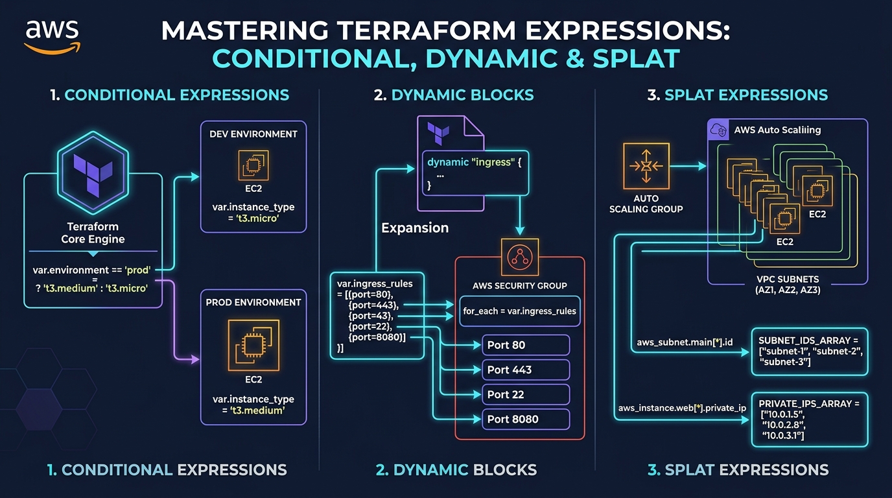

---

## 1. Conditional Expressions

### Overview
A conditional expression uses the value of a boolean expression to select one of two values. It follows the standard ternary syntax:

```hcl
condition ? true_value : false_value
```

### How It Works:
- If `condition` evaluates to `true`, Terraform returns `true_value`.
- If `condition` evaluates to `false`, Terraform returns `false_value`.
- Both `true_value` and `false_value` must evaluate to the same data type (or types that can automatically convert to a common type).

### Common Production Patterns:

#### 1. Environment-Based Sizing
```hcl
locals {
  instance_type = var.environment == "prod" ? "t3.medium" : "t3.micro"
}
```

#### 2. Multi-Tier Cascading Logic
```hcl
locals {
  instance_type = (
    var.environment == "prod" ? "t3.large" :
    var.environment == "staging" ? "t3.medium" : "t3.micro"
  )
}
```

#### 3. Feature Flags & Conditional Resource Provisioning
```hcl
resource "aws_instance" "bastion" {
  count         = var.enable_bastion ? 1 : 0
  ami           = data.aws_ami.amazon_linux_2023.id
  instance_type = "t3.micro"
}
```

#### 4. Conditional Tag Injection
```hcl
locals {
  environment_tags = {
    Environment = var.environment
    Monitoring  = var.environment == "prod" ? "Enhanced-1Min" : "Basic-5Min"
  }
}
```

---

## 2. Dynamic Blocks

### Overview
A `dynamic` block acts like a `for` loop inside a top-level resource or data source block, generating multiple nested blocks from a collection (list, set, or map).

```hcl
dynamic "<BLOCK_TYPE>" {
  for_each = <COLLECTION>
  iterator = <CUSTOM_NAME> # Optional: defaults to <BLOCK_TYPE>
  content {
    # Block configuration referencing iterator.key and iterator.value
  }
}
```

### Key Components:
1. **`for_each`**: The collection to iterate over.
2. **`iterator`** *(optional)*: Sets a custom symbol name for the loop variable (e.g. `rule` instead of `ingress`).
3. **`content`**: The actual inner block schema that repeats for each item.
4. **Accessing Attributes**: Use `<iterator_name>.value.<attribute_name>`.

### Example: Dynamic AWS Security Group Rules
```hcl
resource "aws_security_group" "app_sg" {
  name_prefix = "app-sg-"
  vpc_id      = aws_vpc.main.id

  dynamic "ingress" {
    for_each = var.ingress_rules
    iterator = rule
    content {
      description = rule.value.description
      from_port   = rule.value.port
      to_port     = rule.value.port
      protocol    = rule.value.protocol
      cidr_blocks = rule.value.cidr_blocks
    }
  }
}
```

### When to Use Dynamic Blocks:
- Security Group ingress / egress rules
- Elastic Block Store (EBS) block device attachments on EC2 instances
- IAM Policy Statements within inline policies
- Application Load Balancer listener rules and target group attachments
- Autoscaling Group tag blocks

> **Warning:** Do not overuse dynamic blocks for static configurations. If a resource only has 1 or 2 static nested blocks, writing them explicitly is cleaner and more readable.

---

## 3. Splat Expressions

### Overview
A splat expression provides a concise syntax for extracting a specific attribute from every element in a list of objects or resources without writing full `for` comprehensions.

```hcl
<RESOURCE_LIST>[*].<ATTRIBUTE_NAME>
```

### Comparison: Splat vs. For Expression
| Splat Expression (`[*]`) | Equivalent `for` Expression |
|---|---|
| `aws_subnet.public[*].id` | `[for s in aws_subnet.public : s.id]` |
| `aws_instance.app[*].private_ip` | `[for inst in aws_instance.app : inst.private_ip]` |
| `aws_instance.app[*].arn` | `[for inst in aws_instance.app : inst.arn]` |

### Legacy Splat (`.*`) vs Modern Splat (`[*]`):
- **Legacy Splat (`aws_instance.app.*.id`):** Historically supported, but only applied to lists and tuple values.
- **Modern Splat (`aws_instance.app[*].id`):** Standard since Terraform 0.12. Supports all collection types and gracefully handles null values.

---

## 4. Architectural & Expression Evaluation Flow

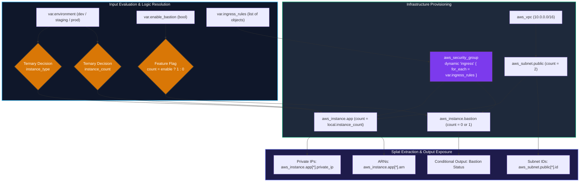

---

## 5. Complete Configuration Files

### 1. `provider.tf`
```hcl
terraform {
  required_version = ">= 1.5.0"

  required_providers {
    aws = {
      source  = "hashicorp/aws"
      version = "~> 5.0"
    }
    random = {
      source  = "hashicorp/random"
      version = "~> 3.5"
    }
  }
}

provider "aws" {
  region = var.aws_region
}

data "aws_region" "current" {}
data "aws_caller_identity" "current" {}
data "aws_availability_zones" "available" {
  state = "available"
}
```

### 2. `variables.tf`
```hcl
variable "aws_region" {
  description = "Target AWS deployment region"
  type        = string
  default     = "us-east-1"
}

variable "environment" {
  description = "Deployment environment (dev, staging, prod)"
  type        = string
  default     = "dev"

  validation {
    condition     = contains(["dev", "staging", "prod"], var.environment)
    error_message = "Environment must be one of: dev, staging, prod."
  }
}

variable "project_name" {
  description = "Project name identifier for resource tagging and naming"
  type        = string
  default     = "day10-expressions"
}

variable "vpc_cidr" {
  description = "IPv4 CIDR block for the VPC"
  type        = string
  default     = "10.0.0.0/16"
}

variable "public_subnet_count" {
  description = "Number of public subnets to deploy across availability zones"
  type        = number
  default     = 2

  validation {
    condition     = var.public_subnet_count >= 1 && var.public_subnet_count <= 4
    error_message = "Public subnet count must be between 1 and 4."
  }
}

variable "enable_bastion" {
  description = "Conditional feature toggle to provision a dedicated management bastion host"
  type        = bool
  default     = false
}

variable "enable_detailed_monitoring" {
  description = "Feature toggle for EC2 detailed CloudWatch monitoring (overridden to true in prod)"
  type        = bool
  default     = false
}

variable "ingress_rules" {
  description = "List of structured ingress firewall rules processed via dynamic block"
  type = list(object({
    port        = number
    protocol    = string
    description = string
    cidr_blocks = list(string)
  }))
  default = [
    {
      port        = 80
      protocol    = "tcp"
      description = "HTTP web traffic"
      cidr_blocks = ["0.0.0.0/0"]
    },
    {
      port        = 443
      protocol    = "tcp"
      description = "HTTPS secure web traffic"
      cidr_blocks = ["0.0.0.0/0"]
    },
    {
      port        = 22
      protocol    = "tcp"
      description = "SSH administrative access"
      cidr_blocks = ["10.0.0.0/16"]
    },
    {
      port        = 8080
      protocol    = "tcp"
      description = "Application server port"
      cidr_blocks = ["10.0.0.0/16"]
    }
  ]
}

variable "egress_rules" {
  description = "List of structured egress firewall rules processed via dynamic block"
  type = list(object({
    from_port   = number
    to_port     = number
    protocol    = string
    description = string
    cidr_blocks = list(string)
  }))
  default = [
    {
      from_port   = 0
      to_port     = 0
      protocol    = "-1"
      description = "Allow all outbound traffic"
      cidr_blocks = ["0.0.0.0/0"]
    }
  ]
}

variable "resource_tags" {
  description = "Standard baseline tags applied across all resources"
  type        = map(string)
  default = {
    Owner     = "DevOps-Team"
    ManagedBy = "Terraform"
    Project   = "Dynamic-Blocks-And-Expressions"
    Day       = "Day_10"
  }
}
```

### 3. `locals.tf`
```hcl
locals {
  name_prefix = "${var.environment}-${var.project_name}"

  # Conditional sizing based on environment
  instance_type = var.environment == "prod" ? "t3.medium" : (var.environment == "staging" ? "t3.small" : "t3.micro")

  # Conditional instance count based on environment
  instance_count = var.environment == "prod" ? 3 : (var.environment == "staging" ? 2 : 1)

  # Conditional monitoring (always true for prod, configurable for non-prod)
  enable_monitoring = var.environment == "prod" ? true : var.enable_detailed_monitoring

  # Dynamically pick availability zones based on subnet count
  selected_azs = slice(data.aws_availability_zones.available.names, 0, var.public_subnet_count)

  # Conditional tags
  environment_tags = {
    Environment = var.environment
    Region      = var.aws_region
    Tier        = var.environment == "prod" ? "Mission-Critical" : "Non-Production"
    Monitoring  = local.enable_monitoring ? "Enhanced-1Min" : "Basic-5Min"
  }

  common_tags = merge(
    var.resource_tags,
    local.environment_tags
  )
}
```

### 4. `main.tf`
```hcl
resource "random_string" "suffix" {
  length  = 6
  special = false
  upper   = false
}

# 1. VPC Infrastructure
resource "aws_vpc" "main" {
  cidr_block           = var.vpc_cidr
  enable_dns_hostnames = true
  enable_dns_support   = true

  tags = merge(
    local.common_tags,
    {
      Name    = "${local.name_prefix}-vpc-${random_string.suffix.result}"
      Pattern = "conditional_vpc"
    }
  )
}

resource "aws_internet_gateway" "gw" {
  vpc_id = aws_vpc.main.id

  tags = merge(
    local.common_tags,
    {
      Name = "${local.name_prefix}-igw-${random_string.suffix.result}"
    }
  )
}

# 2. Public Subnets across multiple AZs
resource "aws_subnet" "public" {
  count                   = var.public_subnet_count
  vpc_id                  = aws_vpc.main.id
  cidr_block              = cidrsubnet(var.vpc_cidr, 8, count.index + 1)
  availability_zone       = local.selected_azs[count.index]
  map_public_ip_on_launch = true

  tags = merge(
    local.common_tags,
    {
      Name = "${local.name_prefix}-public-subnet-${count.index + 1}"
      AZ   = local.selected_azs[count.index]
      Tier = "Public"
    }
  )
}

resource "aws_route_table" "public" {
  vpc_id = aws_vpc.main.id

  route {
    cidr_block = "0.0.0.0/0"
    gateway_id = aws_internet_gateway.gw.id
  }

  tags = merge(
    local.common_tags,
    {
      Name = "${local.name_prefix}-public-rt"
    }
  )
}

resource "aws_route_table_association" "public" {
  count          = var.public_subnet_count
  subnet_id      = aws_subnet.public[count.index].id
  route_table_id = aws_route_table.public.id
}

# 3. Dynamic Blocks Demonstration: Security Group Ingress and Egress
resource "aws_security_group" "app_sg" {
  name_prefix = "${local.name_prefix}-app-sg-"
  description = "Security group dynamically configured via Terraform dynamic blocks"
  vpc_id      = aws_vpc.main.id

  # Dynamic Ingress Rules generated from list of objects
  dynamic "ingress" {
    for_each = var.ingress_rules
    iterator = rule
    content {
      description = rule.value.description
      from_port   = rule.value.port
      to_port     = rule.value.port
      protocol    = rule.value.protocol
      cidr_blocks = rule.value.cidr_blocks
    }
  }

  # Dynamic Egress Rules
  dynamic "egress" {
    for_each = var.egress_rules
    iterator = rule
    content {
      description = rule.value.description
      from_port   = rule.value.from_port
      to_port     = rule.value.to_port
      protocol    = rule.value.protocol
      cidr_blocks = rule.value.cidr_blocks
    }
  }

  lifecycle {
    create_before_destroy = true
  }

  tags = merge(
    local.common_tags,
    {
      Name        = "${local.name_prefix}-app-sg"
      PatternType = "dynamic_block"
    }
  )
}

# 4. Amazon Linux 2023 AMI Lookup
data "aws_ami" "amazon_linux_2023" {
  most_recent = true
  owners      = ["amazon"]

  filter {
    name   = "name"
    values = ["al2023-ami-2023.*-x86_64"]
  }

  filter {
    name   = "virtualization-type"
    values = ["hvm"]
  }
}

# 5. EC2 Instances with Conditional Sizing, Count, and Monitoring
resource "aws_instance" "app" {
  count                       = local.instance_count
  ami                         = data.aws_ami.amazon_linux_2023.id
  instance_type               = local.instance_type
  subnet_id                   = aws_subnet.public[count.index % var.public_subnet_count].id
  vpc_security_group_ids      = [aws_security_group.app_sg.id]
  associate_public_ip_address = true
  monitoring                  = local.enable_monitoring

  user_data = <<-EOF
              #!/bin/bash
              echo "Hello from ${var.environment} App Instance ${count.index + 1}" > /var/www/html/index.html
              EOF

  tags = merge(
    local.common_tags,
    {
      Name        = "${local.name_prefix}-app-node-${count.index + 1}"
      Role        = "Application-Server"
      NodeIndex   = tostring(count.index + 1)
      Environment = var.environment
    }
  )
}

# 6. Conditional Resource Creation: Bastion Host
resource "aws_instance" "bastion" {
  count                  = var.enable_bastion ? 1 : 0
  ami                    = data.aws_ami.amazon_linux_2023.id
  instance_type          = "t3.micro"
  subnet_id              = aws_subnet.public[0].id
  vpc_security_group_ids = [aws_security_group.app_sg.id]

  tags = merge(
    local.common_tags,
    {
      Name = "${local.name_prefix}-bastion"
      Role = "Bastion-Host"
    }
  )
}
```

### 5. `outputs.tf`
```hcl
output "vpc_id" {
  description = "ID of the provisioned VPC"
  value       = aws_vpc.main.id
}

# 1. Splat Expressions on Subnets
output "public_subnet_ids" {
  description = "List of public subnet IDs extracted via splat expression ([*])"
  value       = aws_subnet.public[*].id
}

output "public_subnet_cidrs" {
  description = "List of public subnet CIDR blocks extracted via splat expression ([*])"
  value       = aws_subnet.public[*].cidr_block
}

output "public_subnet_arns" {
  description = "List of public subnet ARNs extracted via splat expression ([*])"
  value       = aws_subnet.public[*].arn
}

# 2. Dynamic Security Group Output
output "security_group_id" {
  description = "ID of the dynamically configured security group"
  value       = aws_security_group.app_sg.id
}

# 3. Splat Expressions on EC2 Instances
output "app_instance_ids" {
  description = "List of EC2 application instance IDs extracted via splat expression ([*])"
  value       = aws_instance.app[*].id
}

output "app_instance_private_ips" {
  description = "List of application instance private IP addresses extracted via splat expression ([*])"
  value       = aws_instance.app[*].private_ip
}

output "app_instance_public_ips" {
  description = "List of application instance public IP addresses extracted via splat expression ([*])"
  value       = aws_instance.app[*].public_ip
}

output "app_instance_arns" {
  description = "List of application instance ARNs extracted via splat expression ([*])"
  value       = aws_instance.app[*].arn
}

# 4. Conditional Output for Bastion Host
output "bastion_host_info" {
  description = "Conditional output showing bastion host public IP if enabled, or a disabled notice"
  value = var.enable_bastion ? {
    status    = "enabled"
    id        = aws_instance.bastion[0].id
    public_ip = aws_instance.bastion[0].public_ip
    } : {
    status    = "disabled"
    id        = "none"
    public_ip = "none"
  }
}

# 5. Expressions Demonstration Summary
output "expressions_demonstration_summary" {
  description = "Summary of dynamic blocks, conditional expressions, and splat expressions applied in Day 10"
  value = {
    environment_evaluation = {
      target_env     = var.environment
      chosen_type    = local.instance_type
      instance_count = local.instance_count
      monitoring     = local.enable_monitoring ? "enabled" : "disabled"
    }
    dynamic_blocks = {
      ingress_rule_count = length(var.ingress_rules)
      egress_rule_count  = length(var.egress_rules)
    }
    splat_extraction = {
      subnet_count   = length(aws_subnet.public[*].id)
      instance_count = length(aws_instance.app[*].id)
    }
  }
}
```

---

## 6. Verification & Screenshots

### 1. Terraform Syntax Validation (`terraform validate`)
Verification that all configuration syntax, dynamic block semantics, and conditional expressions are valid:

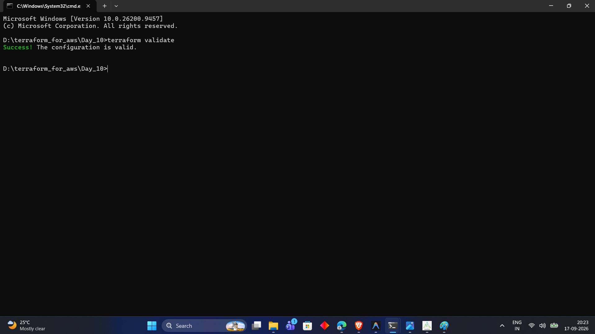

---

### 2. Dev Mode Plan - Application Instance Evaluation
Execution plan evaluating `var.environment == "dev"`, provisioning a single `t3.micro` EC2 node with basic monitoring disabled:

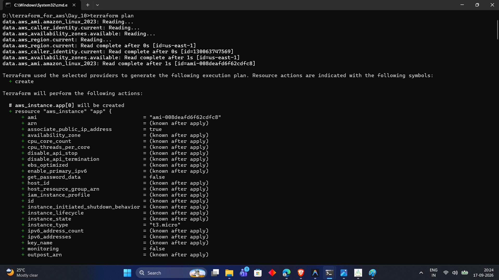

---

### 3. Dev Mode Plan - VPC & Subnet Expansion
Execution plan detailing the VPC, random suffix generator, and 10 total resources to create:

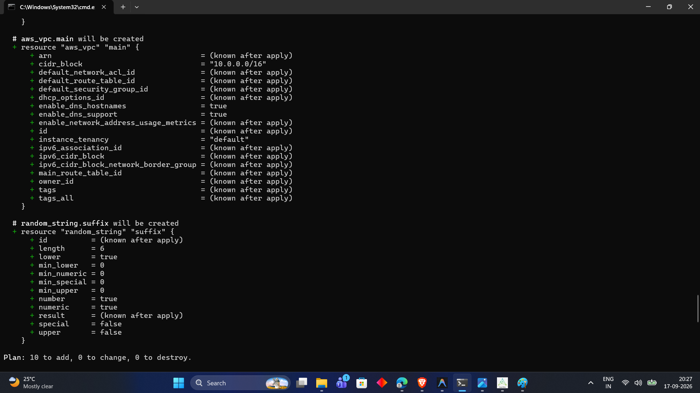

---

### 4. Dev Mode Plan - Outputs Preview & Splat Expressions
Execution plan output resolution preview demonstrating splat attributes (`public_subnet_*`, `app_instance_*`) and conditional disabled bastion:

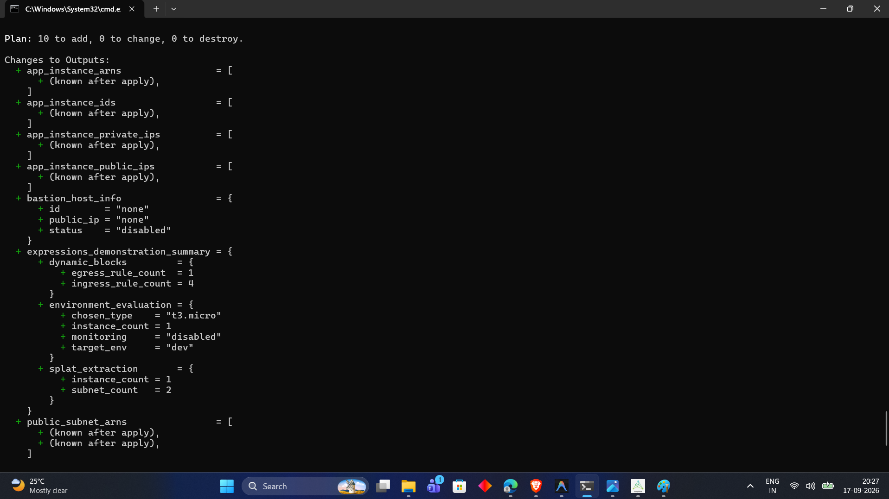

---

### 5. Terraform Apply Execution
Initiating `terraform apply` to provision the VPC, subnets, dynamic security groups, and compute cluster:

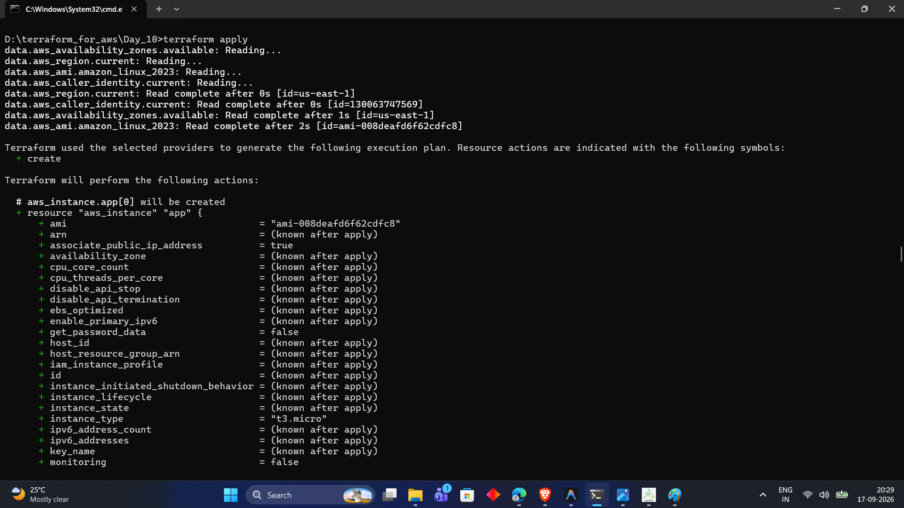

---

### 6. Deployment Completion & Initial Outputs
Successful completion of all 10 resources with application instance ARNs and IDs:

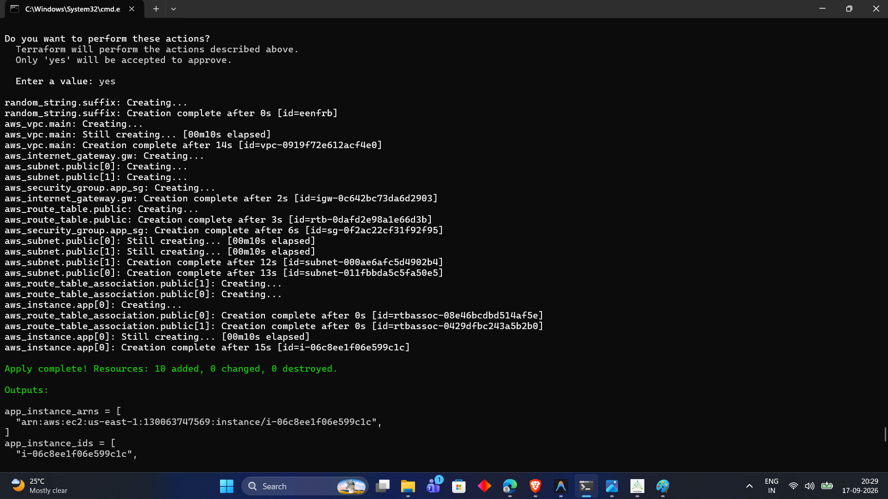

---

### 7. Splat Outputs & Expressions Summary Map
Full structured output map showing splat extraction across subnets, dynamic rule counts, and bastion disabled status:

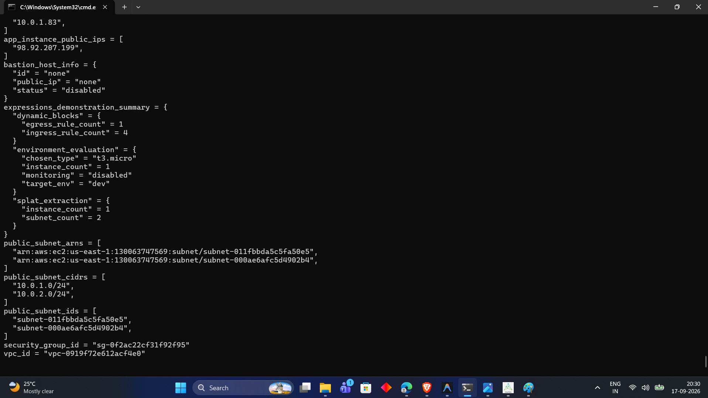

---

### 8. AWS Management Console - Dynamic Security Group Inbound Rules
AWS VPC Console showing the security group with all 4 ingress rules (Ports 443, 22, 80, 8080) dynamically generated:

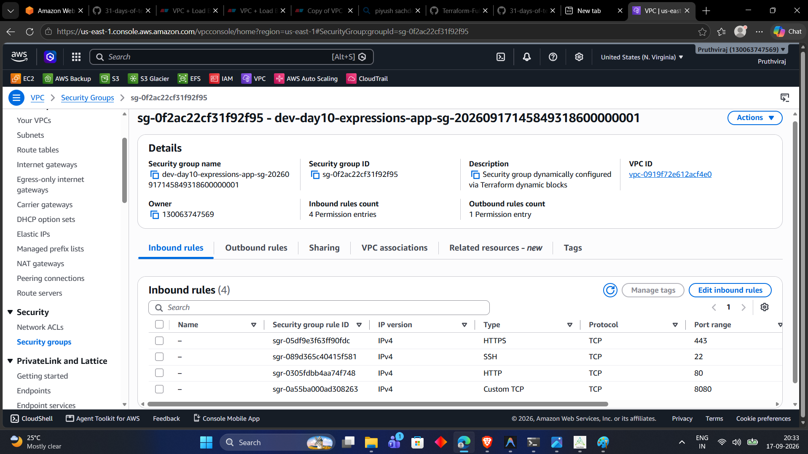

---

### 9. AWS Management Console - Multi-AZ Public Subnets
AWS VPC Console verifying the 2 public subnets deployed across availability zones `us-east-1a` (10.0.1.0/24) and `us-east-1b` (10.0.2.0/24):

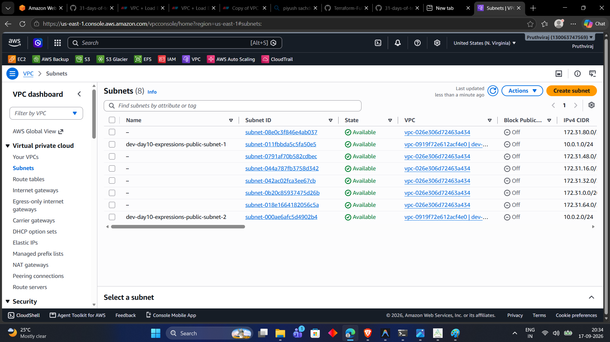

---

### 10. AWS Management Console - EC2 Application Node
AWS EC2 Console confirming the application instance `dev-day10-expressions-app-node-1` running with `t3.micro`:

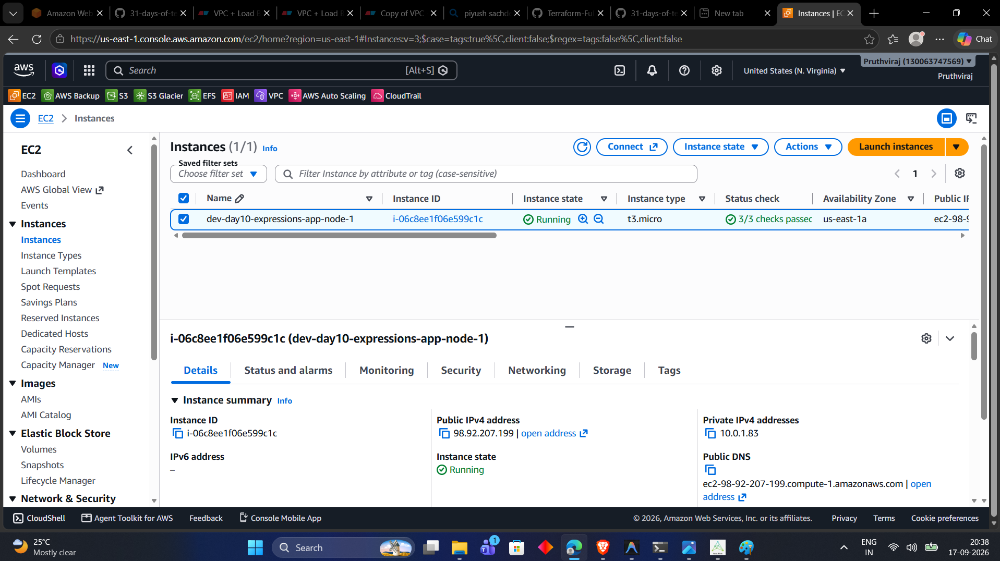

---

### 11. Production Scale-Up Plan & Bastion Feature Toggle
Execution plan verifying conditional expressions under `environment = "prod"` and `enable_bastion = true` (scaling to 3 nodes, `t3.medium`, enabled monitoring, and bastion):

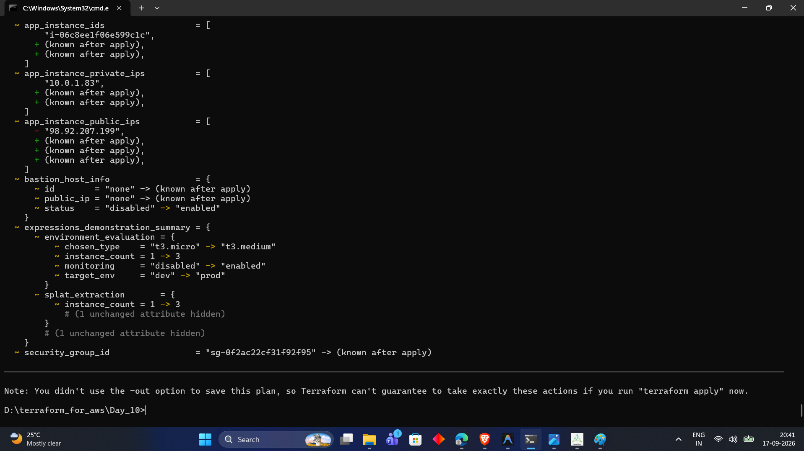

---

### 12. Clean State Teardown (`terraform destroy`)
Successful teardown of all 10 AWS resources to maintain a clean environment and eliminate cloud costs:

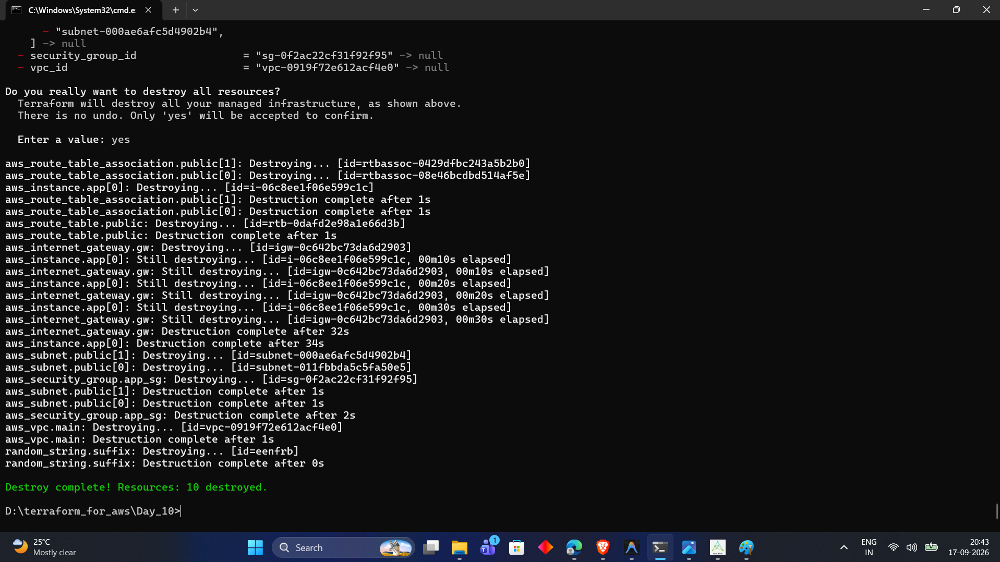

---

## 7. Key Takeaways

1. **Ternary Expressions for Clean Code:** Use ternary conditionals (`condition ? true_val : false_val`) to adapt configurations across environments without duplicating code files.
2. **Dynamic Blocks for Nested Schemas:** Use dynamic blocks specifically for repeating child blocks inside resources (like security group rules or EBS mappings). Avoid overusing them for simple, static child blocks.
3. **Custom Iterator Naming:** Always use `iterator = <name>` inside dynamic blocks to make the inner `content` block explicit and readable (e.g. `rule.value.port`).
4. **Splat Conciseness:** Use modern splat expressions (`[*]`) to extract attributes from lists of resources into clean, compact output lists.
5. **Feature Flagging with `count`:** Use `count = var.feature_enabled ? 1 : 0` to enable or disable optional infrastructure components on demand.

---

## 8. Commands Reference

| Command | Purpose |
|---|---|
| `terraform init` | Initialize provider plugins and validate dependencies |
| `terraform fmt` | Rewrites configuration files to canonical format and style |
| `terraform validate` | Validates configuration syntax, dynamic block semantics, and types |
| `terraform plan` | Generates execution plan showing conditional evaluation and dynamic expansions |
| `terraform apply -auto-approve` | Provisions infrastructure across subnets and dynamic security groups |
| `terraform destroy -auto-approve` | Tears down all resources created during testing |

---

## Next Steps

In **Day 11**, we will explore **Terraform Built-in Functions**, including string manipulation (`format`, `join`, `replace`), collection functions (`merge`, `concat`, `slice`, `lookup`), and filesystem functions (`file`, `templatefile`) to build production-grade automation workflows.

